# ERP Qween - توثيق ERD الكامل وهيكل قاعدة البيانات

- تاريخ التوليد: `2026-03-01T12:50:50.816438Z`
- ملف المصدر الهيكلي: `d:/cursor project/erp qween/prisma/schema.full.sql`
- ملف SQL النهائي للبناء: `prisma/schema.full.sql`

## 1) إحصاءات سريعة

- عدد الجداول: **67**
- عدد الـ Enums: **15**
- عدد العلاقات (Foreign Keys): **40**
- عدد الفهارس الفريدة (Unique Indexes): **47**
- عدد الفهارس العادية: **15**

## 2) شرح هيكلي تفصيلي حسب المجالات

- الحوكمة والصلاحيات: جداول `User`, `Role`, `AuthSession`, `UserMfaSetting`, `SecurityPolicy`, `AuditLog` تدير الهوية، الجلسات، الصلاحيات، والتدقيق.
- القلب المحاسبي: `Account`, `FiscalYear`, `AccountingPeriod`, `JournalEntry`, `JournalLine`, `AccountBalance` تشكل دفتر الأستاذ والقيد المزدوج وضبط الفترات.
- العملاء/الموردون والتحصيل/السداد: `Customer`, `Supplier`, `Invoice`, `InvoiceLine`, `Payment`, `PaymentAllocation` تغطي دورة الذمم والتسويات.
- البنوك والخزينة: `BankAccount`, `BankTransaction` تربط حركات البنك بالقيود المحاسبية.
- الأصول الثابتة: `AssetCategory`, `FixedAsset`, `DepreciationSchedule` لإدارة الرسملة والإهلاك.
- التخطيط والرقابة: `Budget`, `BudgetLine` للموازنات على مستوى الحساب والفترة.
- الضرائب: `TaxCode`, `TaxDeclaration` لتعريفات الضرائب والإقرارات.
- المخزون والعمليات التجارية: `Item*`, `Warehouse*`, `Stock*`, `SalesQuote`, `SalesReturn`, `PurchaseOrder*`, `PurchaseReturn`, `PurchaseReceipt`.
- المشاريع وCRM والموارد البشرية والعقود: `Project*`, `Opportunity`, `SupportTicket*`, `Employee`, `LeaveRequest`, `Payroll*`, `Contract*`.
- تشغيل المنصة: `BackupJob`, `IntegrationSetting`, `ScheduledReport`, `SavedReport`, `Notification`, `UserTask`, `SystemSettings`, `CompanyProfile`.

## 3) مخطط ERD الكامل (كل الجداول + كل روابط FK)

```mermaid
erDiagram
  Account {
    SERIAL id PK
    INTEGER parentId FK
  }
  AccountBalance {
    SERIAL id PK
    INTEGER accountId FK
  }
  AccountingPeriod {
    SERIAL id PK
    INTEGER fiscalYearId FK
  }
  AssetCategory {
    SERIAL id PK
  }
  AuditLog {
    SERIAL id PK
    INTEGER userId FK
  }
  AuthSession {
    SERIAL id PK
    INTEGER userId FK
  }
  BackupJob {
    SERIAL id PK
  }
  BankAccount {
    SERIAL id PK
    INTEGER glAccountId FK
  }
  BankTransaction {
    SERIAL id PK
    INTEGER bankId FK
    INTEGER journalEntryId FK
  }
  Budget {
    SERIAL id PK
  }
  BudgetLine {
    SERIAL id PK
    INTEGER budgetId FK
    INTEGER accountId FK
  }
  CompanyProfile {
    INTEGER id PK
  }
  Contact {
    SERIAL id PK
    INTEGER customerId FK
    INTEGER supplierId FK
  }
  Contract {
    SERIAL id PK
  }
  ContractMilestone {
    SERIAL id PK
  }
  CostCenter {
    SERIAL id PK
  }
  Currency {
    SERIAL id PK
  }
  Customer {
    SERIAL id PK
  }
  Department {
    SERIAL id PK
    INTEGER parentId FK
  }
  DepreciationSchedule {
    SERIAL id PK
    INTEGER assetId FK
    INTEGER journalEntryId FK
  }
  Employee {
    SERIAL id PK
  }
  ExchangeRate {
    SERIAL id PK
  }
  FiscalYear {
    SERIAL id PK
  }
  FixedAsset {
    SERIAL id PK
    INTEGER categoryId FK
  }
  IntegrationSetting {
    SERIAL id PK
  }
  Invoice {
    SERIAL id PK
    INTEGER customerId FK
    INTEGER supplierId FK
    INTEGER projectId FK
    INTEGER createdById FK
    INTEGER journalEntryId FK
  }
  InvoiceLine {
    SERIAL id PK
    INTEGER invoiceId FK
  }
  Item {
    SERIAL id PK
    INTEGER categoryId FK
    INTEGER unitId FK
  }
  ItemCategory {
    SERIAL id PK
  }
  JournalEntry {
    SERIAL id PK
    INTEGER periodId FK
    INTEGER createdById FK
    INTEGER postedById FK
  }
  JournalLine {
    SERIAL id PK
    INTEGER entryId FK
    INTEGER accountId FK
    INTEGER projectId FK
    INTEGER departmentId FK
    INTEGER costCenterId FK
  }
  LeaveRequest {
    SERIAL id PK
  }
  Notification {
    SERIAL id PK
  }
  Opportunity {
    SERIAL id PK
  }
  Payment {
    SERIAL id PK
    INTEGER bankId FK
    INTEGER customerId FK
    INTEGER supplierId FK
    INTEGER journalEntryId FK
    INTEGER createdById FK
  }
  PaymentAllocation {
    SERIAL id PK
    INTEGER paymentId FK
    INTEGER invoiceId FK
  }
  PayrollLine {
    SERIAL id PK
  }
  PayrollRun {
    SERIAL id PK
  }
  Project {
    SERIAL id PK
  }
  ProjectExpense {
    SERIAL id PK
  }
  ProjectTask {
    SERIAL id PK
  }
  PurchaseOrder {
    SERIAL id PK
  }
  PurchaseOrderLine {
    SERIAL id PK
  }
  PurchaseReceipt {
    SERIAL id PK
  }
  PurchaseReturn {
    SERIAL id PK
  }
  Role {
    SERIAL id PK
  }
  SalesQuote {
    SERIAL id PK
  }
  SalesReturn {
    SERIAL id PK
  }
  SavedReport {
    SERIAL id PK
  }
  ScheduledReport {
    SERIAL id PK
  }
  SecurityPolicy {
    INTEGER id PK
  }
  StockBalance {
    SERIAL id PK
  }
  StockCount {
    SERIAL id PK
  }
  StockCountLine {
    SERIAL id PK
  }
  StockMovement {
    SERIAL id PK
  }
  Supplier {
    SERIAL id PK
  }
  SupportTicket {
    SERIAL id PK
  }
  SupportTicketMessage {
    SERIAL id PK
  }
  SystemSettings {
    INTEGER id PK
  }
  TaxCode {
    SERIAL id PK
  }
  TaxDeclaration {
    SERIAL id PK
  }
  Unit {
    SERIAL id PK
  }
  User {
    SERIAL id PK
    INTEGER roleId FK
  }
  UserMfaSetting {
    SERIAL id PK
  }
  UserTask {
    SERIAL id PK
  }
  Warehouse {
    SERIAL id PK
  }
  WarehouseLocation {
    SERIAL id PK
  }
  Account ||--o{ Account : "Account_parentId_fkey"
  Account ||--|{ AccountBalance : "AccountBalance_accountId_fkey"
  Account ||--o{ BankAccount : "BankAccount_glAccountId_fkey"
  Account ||--|{ BudgetLine : "BudgetLine_accountId_fkey"
  Account ||--|{ JournalLine : "JournalLine_accountId_fkey"
  AccountingPeriod ||--o{ JournalEntry : "JournalEntry_periodId_fkey"
  AssetCategory ||--|{ FixedAsset : "FixedAsset_categoryId_fkey"
  BankAccount ||--|{ BankTransaction : "BankTransaction_bankId_fkey"
  BankAccount ||--o{ Payment : "Payment_bankId_fkey"
  Budget ||--|{ BudgetLine : "BudgetLine_budgetId_fkey"
  CostCenter ||--o{ JournalLine : "JournalLine_costCenterId_fkey"
  Customer ||--o{ Contact : "Contact_customerId_fkey"
  Customer ||--o{ Invoice : "Invoice_customerId_fkey"
  Customer ||--o{ Payment : "Payment_customerId_fkey"
  Department ||--o{ Department : "Department_parentId_fkey"
  Department ||--o{ JournalLine : "JournalLine_departmentId_fkey"
  FiscalYear ||--|{ AccountingPeriod : "AccountingPeriod_fiscalYearId_fkey"
  FixedAsset ||--|{ DepreciationSchedule : "DepreciationSchedule_assetId_fkey"
  Invoice ||--|{ InvoiceLine : "InvoiceLine_invoiceId_fkey"
  Invoice ||--|{ PaymentAllocation : "PaymentAllocation_invoiceId_fkey"
  ItemCategory ||--o{ Item : "Item_categoryId_fkey"
  JournalEntry ||--o{ BankTransaction : "BankTransaction_journalEntryId_fkey"
  JournalEntry ||--o{ DepreciationSchedule : "DepreciationSchedule_journalEntryId_fkey"
  JournalEntry ||--o{ Invoice : "Invoice_journalEntryId_fkey"
  JournalEntry ||--|{ JournalLine : "JournalLine_entryId_fkey"
  JournalEntry ||--o{ Payment : "Payment_journalEntryId_fkey"
  Payment ||--|{ PaymentAllocation : "PaymentAllocation_paymentId_fkey"
  Project ||--o{ Invoice : "Invoice_projectId_fkey"
  Project ||--o{ JournalLine : "JournalLine_projectId_fkey"
  Role ||--|{ User : "User_roleId_fkey"
  Supplier ||--o{ Contact : "Contact_supplierId_fkey"
  Supplier ||--o{ Invoice : "Invoice_supplierId_fkey"
  Supplier ||--o{ Payment : "Payment_supplierId_fkey"
  Unit ||--o{ Item : "Item_unitId_fkey"
  User ||--o{ AuditLog : "AuditLog_userId_fkey"
  User ||--|{ AuthSession : "AuthSession_userId_fkey"
  User ||--o{ Invoice : "Invoice_createdById_fkey"
  User ||--|{ JournalEntry : "JournalEntry_createdById_fkey"
  User ||--o{ JournalEntry : "JournalEntry_postedById_fkey"
  User ||--o{ Payment : "Payment_createdById_fkey"
```

## 4) مصفوفة العلاقات (Foreign Keys) كاملة

| # | Child Table | Child Column(s) | Parent Table | Parent Column(s) | ON DELETE | ON UPDATE | Constraint |
|---|---|---|---|---|---|---|---|
| 1 | Account | parentId | Account | id | SET NULL | CASCADE | Account_parentId_fkey |
| 2 | AccountBalance | accountId | Account | id | CASCADE | CASCADE | AccountBalance_accountId_fkey |
| 3 | AccountingPeriod | fiscalYearId | FiscalYear | id | CASCADE | CASCADE | AccountingPeriod_fiscalYearId_fkey |
| 4 | AuditLog | userId | User | id | SET NULL | CASCADE | AuditLog_userId_fkey |
| 5 | AuthSession | userId | User | id | CASCADE | CASCADE | AuthSession_userId_fkey |
| 6 | BankAccount | glAccountId | Account | id | SET NULL | CASCADE | BankAccount_glAccountId_fkey |
| 7 | BankTransaction | bankId | BankAccount | id | CASCADE | CASCADE | BankTransaction_bankId_fkey |
| 8 | BankTransaction | journalEntryId | JournalEntry | id | SET NULL | CASCADE | BankTransaction_journalEntryId_fkey |
| 9 | BudgetLine | accountId | Account | id | RESTRICT | CASCADE | BudgetLine_accountId_fkey |
| 10 | BudgetLine | budgetId | Budget | id | CASCADE | CASCADE | BudgetLine_budgetId_fkey |
| 11 | Contact | customerId | Customer | id | CASCADE | CASCADE | Contact_customerId_fkey |
| 12 | Contact | supplierId | Supplier | id | CASCADE | CASCADE | Contact_supplierId_fkey |
| 13 | Department | parentId | Department | id | SET NULL | CASCADE | Department_parentId_fkey |
| 14 | DepreciationSchedule | assetId | FixedAsset | id | CASCADE | CASCADE | DepreciationSchedule_assetId_fkey |
| 15 | DepreciationSchedule | journalEntryId | JournalEntry | id | SET NULL | CASCADE | DepreciationSchedule_journalEntryId_fkey |
| 16 | FixedAsset | categoryId | AssetCategory | id | RESTRICT | CASCADE | FixedAsset_categoryId_fkey |
| 17 | Invoice | createdById | User | id | SET NULL | CASCADE | Invoice_createdById_fkey |
| 18 | Invoice | customerId | Customer | id | SET NULL | CASCADE | Invoice_customerId_fkey |
| 19 | Invoice | journalEntryId | JournalEntry | id | SET NULL | CASCADE | Invoice_journalEntryId_fkey |
| 20 | Invoice | projectId | Project | id | SET NULL | CASCADE | Invoice_projectId_fkey |
| 21 | Invoice | supplierId | Supplier | id | SET NULL | CASCADE | Invoice_supplierId_fkey |
| 22 | InvoiceLine | invoiceId | Invoice | id | CASCADE | CASCADE | InvoiceLine_invoiceId_fkey |
| 23 | Item | categoryId | ItemCategory | id | SET NULL | CASCADE | Item_categoryId_fkey |
| 24 | Item | unitId | Unit | id | SET NULL | CASCADE | Item_unitId_fkey |
| 25 | JournalEntry | createdById | User | id | RESTRICT | CASCADE | JournalEntry_createdById_fkey |
| 26 | JournalEntry | periodId | AccountingPeriod | id | SET NULL | CASCADE | JournalEntry_periodId_fkey |
| 27 | JournalEntry | postedById | User | id | SET NULL | CASCADE | JournalEntry_postedById_fkey |
| 28 | JournalLine | accountId | Account | id | RESTRICT | CASCADE | JournalLine_accountId_fkey |
| 29 | JournalLine | costCenterId | CostCenter | id | SET NULL | CASCADE | JournalLine_costCenterId_fkey |
| 30 | JournalLine | departmentId | Department | id | SET NULL | CASCADE | JournalLine_departmentId_fkey |
| 31 | JournalLine | entryId | JournalEntry | id | CASCADE | CASCADE | JournalLine_entryId_fkey |
| 32 | JournalLine | projectId | Project | id | SET NULL | CASCADE | JournalLine_projectId_fkey |
| 33 | Payment | bankId | BankAccount | id | SET NULL | CASCADE | Payment_bankId_fkey |
| 34 | Payment | createdById | User | id | SET NULL | CASCADE | Payment_createdById_fkey |
| 35 | Payment | customerId | Customer | id | SET NULL | CASCADE | Payment_customerId_fkey |
| 36 | Payment | journalEntryId | JournalEntry | id | SET NULL | CASCADE | Payment_journalEntryId_fkey |
| 37 | Payment | supplierId | Supplier | id | SET NULL | CASCADE | Payment_supplierId_fkey |
| 38 | PaymentAllocation | invoiceId | Invoice | id | CASCADE | CASCADE | PaymentAllocation_invoiceId_fkey |
| 39 | PaymentAllocation | paymentId | Payment | id | CASCADE | CASCADE | PaymentAllocation_paymentId_fkey |
| 40 | User | roleId | Role | id | RESTRICT | CASCADE | User_roleId_fkey |

## 5) قيم Enums

- **AccountType**: `ASSET`, `LIABILITY`, `EQUITY`, `REVENUE`, `EXPENSE`
- **AssetStatus**: `ACTIVE`, `MAINTENANCE`, `SOLD`, `SCRAPPED`
- **BudgetControlLevel**: `NONE`, `WARNING`, `HARD`
- **BudgetStatus**: `DRAFT`, `ACTIVE`, `CLOSED`
- **FiscalYearStatus**: `OPEN`, `CLOSED`, `ADJUSTING`
- **InvoiceStatus**: `DRAFT`, `ISSUED`, `PAID`, `PARTIAL`, `CANCELLED`
- **InvoiceType**: `SALES`, `PURCHASE`
- **JournalSource**: `MANUAL`, `SALES`, `PURCHASE`, `PAYROLL`, `ASSETS`, `REVERSAL`
- **JournalStatus**: `DRAFT`, `PENDING`, `POSTED`, `VOID`, `REVERSED`
- **PaymentMethod**: `CASH`, `BANK_TRANSFER`, `CHECK`, `CARD`
- **PaymentStatus**: `PENDING`, `COMPLETED`, `CANCELLED`, `BOUNCED`
- **PaymentType**: `RECEIPT`, `PAYMENT`
- **PeriodStatus**: `OPEN`, `CLOSED`
- **TaxDeclarationStatus**: `DRAFT`, `FILED`, `PAID`, `CANCELLED`
- **TaxType**: `VAT`, `WHT`

## 6) قاموس البيانات التفصيلي (كل الجداول)

### Account

- Primary key: `id`
- Outgoing foreign keys: **1**
- Incoming foreign keys: **5**

| Column | Type | Nullable | Default | Notes |
|---|---|---|---|---|
| `id` | `SERIAL` | NO | `` | PK |
| `code` | `TEXT` | NO | `` | UNIQUE |
| `nameAr` | `TEXT` | NO | `` |  |
| `nameEn` | `TEXT` | YES | `` |  |
| `type` | `"AccountType"` | NO | `` |  |
| `subType` | `TEXT` | YES | `` |  |
| `parentId` | `INTEGER` | YES | `` | FK |
| `level` | `INTEGER` | NO | `1` |  |
| `isControl` | `BOOLEAN` | NO | `false` |  |
| `allowPosting` | `BOOLEAN` | NO | `true` |  |
| `normalBalance` | `TEXT` | NO | `'Debit'` |  |
| `isActive` | `BOOLEAN` | NO | `true` |  |
| `createdAt` | `TIMESTAMP(3)` | NO | `CURRENT_TIMESTAMP` |  |
| `updatedAt` | `TIMESTAMP(3)` | NO | `` |  |

Outgoing relations:

| Child Column(s) | Parent | Parent Column(s) | ON DELETE | ON UPDATE | Constraint |
|---|---|---|---|---|---|
| `parentId` | `Account` | `id `| `SET NULL` | `CASCADE` | `Account_parentId_fkey` |

Incoming relations:

| Child Table | Child Column(s) | ON DELETE | ON UPDATE | Constraint |
|---|---|---|---|---|
| `Account` | `parentId `| `SET NULL` | `CASCADE` | `Account_parentId_fkey` |
| `AccountBalance` | `accountId `| `CASCADE` | `CASCADE` | `AccountBalance_accountId_fkey` |
| `BankAccount` | `glAccountId `| `SET NULL` | `CASCADE` | `BankAccount_glAccountId_fkey` |
| `BudgetLine` | `accountId `| `RESTRICT` | `CASCADE` | `BudgetLine_accountId_fkey` |
| `JournalLine` | `accountId `| `RESTRICT` | `CASCADE` | `JournalLine_accountId_fkey` |

Indexes:

| Type | Name | Columns |
|---|---|---|
| UNIQUE | `Account_code_key` | `code `|

### AccountBalance

- Primary key: `id`
- Outgoing foreign keys: **1**
- Incoming foreign keys: **0**

| Column | Type | Nullable | Default | Notes |
|---|---|---|---|---|
| `id` | `SERIAL` | NO | `` | PK |
| `accountId` | `INTEGER` | NO | `` | FK |
| `fiscalYear` | `INTEGER` | NO | `` |  |
| `period` | `INTEGER` | NO | `` |  |
| `openingBalance` | `DECIMAL(65,30)` | NO | `0` |  |
| `debit` | `DECIMAL(65,30)` | NO | `0` |  |
| `credit` | `DECIMAL(65,30)` | NO | `0` |  |
| `closingBalance` | `DECIMAL(65,30)` | NO | `0` |  |
| `createdAt` | `TIMESTAMP(3)` | NO | `CURRENT_TIMESTAMP` |  |
| `updatedAt` | `TIMESTAMP(3)` | NO | `` |  |

Outgoing relations:

| Child Column(s) | Parent | Parent Column(s) | ON DELETE | ON UPDATE | Constraint |
|---|---|---|---|---|---|
| `accountId` | `Account` | `id `| `CASCADE` | `CASCADE` | `AccountBalance_accountId_fkey` |

Indexes:

| Type | Name | Columns |
|---|---|---|
| UNIQUE | `AccountBalance_accountId_fiscalYear_period_key` | `accountId, fiscalYear, period `|
| INDEX | `AccountBalance_fiscalYear_period_idx` | `fiscalYear, period `|

### AccountingPeriod

- Primary key: `id`
- Outgoing foreign keys: **1**
- Incoming foreign keys: **1**

| Column | Type | Nullable | Default | Notes |
|---|---|---|---|---|
| `id` | `SERIAL` | NO | `` | PK |
| `fiscalYearId` | `INTEGER` | NO | `` | FK |
| `number` | `INTEGER` | NO | `` |  |
| `name` | `TEXT` | NO | `` |  |
| `startDate` | `TIMESTAMP(3)` | NO | `` |  |
| `endDate` | `TIMESTAMP(3)` | NO | `` |  |
| `status` | `"PeriodStatus"` | NO | `'OPEN'` |  |
| `canPost` | `BOOLEAN` | NO | `true` |  |
| `closedAt` | `TIMESTAMP(3)` | YES | `` |  |
| `closedBy` | `INTEGER` | YES | `` |  |

Outgoing relations:

| Child Column(s) | Parent | Parent Column(s) | ON DELETE | ON UPDATE | Constraint |
|---|---|---|---|---|---|
| `fiscalYearId` | `FiscalYear` | `id `| `CASCADE` | `CASCADE` | `AccountingPeriod_fiscalYearId_fkey` |

Incoming relations:

| Child Table | Child Column(s) | ON DELETE | ON UPDATE | Constraint |
|---|---|---|---|---|
| `JournalEntry` | `periodId `| `SET NULL` | `CASCADE` | `JournalEntry_periodId_fkey` |

Indexes:

| Type | Name | Columns |
|---|---|---|
| UNIQUE | `AccountingPeriod_fiscalYearId_number_key` | `fiscalYearId, number `|
| INDEX | `AccountingPeriod_startDate_endDate_idx` | `startDate, endDate `|

### AssetCategory

- Primary key: `id`
- Outgoing foreign keys: **0**
- Incoming foreign keys: **1**

| Column | Type | Nullable | Default | Notes |
|---|---|---|---|---|
| `id` | `SERIAL` | NO | `` | PK |
| `code` | `TEXT` | NO | `` | UNIQUE |
| `nameAr` | `TEXT` | NO | `` |  |
| `nameEn` | `TEXT` | YES | `` |  |
| `depreciationMethod` | `TEXT` | NO | `'StraightLine'` |  |
| `usefulLifeMonths` | `INTEGER` | NO | `` |  |
| `salvagePercent` | `DECIMAL(65,30)` | NO | `0` |  |
| `glAssetId` | `INTEGER` | YES | `` |  |
| `glAccumulatedId` | `INTEGER` | YES | `` |  |
| `glExpenseId` | `INTEGER` | YES | `` |  |
| `isActive` | `BOOLEAN` | NO | `true` |  |
| `createdAt` | `TIMESTAMP(3)` | NO | `CURRENT_TIMESTAMP` |  |

Incoming relations:

| Child Table | Child Column(s) | ON DELETE | ON UPDATE | Constraint |
|---|---|---|---|---|
| `FixedAsset` | `categoryId `| `RESTRICT` | `CASCADE` | `FixedAsset_categoryId_fkey` |

Indexes:

| Type | Name | Columns |
|---|---|---|
| UNIQUE | `AssetCategory_code_key` | `code `|

### AuditLog

- Primary key: `id`
- Outgoing foreign keys: **1**
- Incoming foreign keys: **0**

| Column | Type | Nullable | Default | Notes |
|---|---|---|---|---|
| `id` | `SERIAL` | NO | `` | PK |
| `userId` | `INTEGER` | YES | `` | FK |
| `table` | `TEXT` | NO | `` |  |
| `recordId` | `INTEGER` | YES | `` |  |
| `action` | `TEXT` | NO | `` |  |
| `oldValue` | `JSONB` | YES | `` |  |
| `newValue` | `JSONB` | YES | `` |  |
| `ipAddress` | `TEXT` | YES | `` |  |
| `userAgent` | `TEXT` | YES | `` |  |
| `createdAt` | `TIMESTAMP(3)` | NO | `CURRENT_TIMESTAMP` |  |

Outgoing relations:

| Child Column(s) | Parent | Parent Column(s) | ON DELETE | ON UPDATE | Constraint |
|---|---|---|---|---|---|
| `userId` | `User` | `id `| `SET NULL` | `CASCADE` | `AuditLog_userId_fkey` |

Indexes:

| Type | Name | Columns |
|---|---|---|
| INDEX | `AuditLog_createdAt_idx` | `createdAt `|
| INDEX | `AuditLog_table_recordId_idx` | `table, recordId `|

### AuthSession

- Primary key: `id`
- Outgoing foreign keys: **1**
- Incoming foreign keys: **0**

| Column | Type | Nullable | Default | Notes |
|---|---|---|---|---|
| `id` | `SERIAL` | NO | `` | PK |
| `userId` | `INTEGER` | NO | `` | FK |
| `refreshToken` | `TEXT` | NO | `` | UNIQUE |
| `expiresAt` | `TIMESTAMP(3)` | NO | `` |  |
| `revokedAt` | `TIMESTAMP(3)` | YES | `` |  |
| `createdAt` | `TIMESTAMP(3)` | NO | `CURRENT_TIMESTAMP` |  |

Outgoing relations:

| Child Column(s) | Parent | Parent Column(s) | ON DELETE | ON UPDATE | Constraint |
|---|---|---|---|---|---|
| `userId` | `User` | `id `| `CASCADE` | `CASCADE` | `AuthSession_userId_fkey` |

Indexes:

| Type | Name | Columns |
|---|---|---|
| UNIQUE | `AuthSession_refreshToken_key` | `refreshToken `|
| INDEX | `AuthSession_userId_idx` | `userId `|

### BackupJob

- Primary key: `id`
- Outgoing foreign keys: **0**
- Incoming foreign keys: **0**

| Column | Type | Nullable | Default | Notes |
|---|---|---|---|---|
| `id` | `SERIAL` | NO | `` | PK |
| `action` | `TEXT` | NO | `'BACKUP'` |  |
| `status` | `TEXT` | NO | `'QUEUED'` |  |
| `fileName` | `TEXT` | YES | `` |  |
| `fileSize` | `DECIMAL(65,30)` | YES | `` |  |
| `storagePath` | `TEXT` | YES | `` |  |
| `isScheduled` | `BOOLEAN` | NO | `false` |  |
| `scheduleExpr` | `TEXT` | YES | `` |  |
| `sourceBackupId` | `INTEGER` | YES | `` |  |
| `requestedBy` | `INTEGER` | YES | `` |  |
| `requestedAt` | `TIMESTAMP(3)` | NO | `CURRENT_TIMESTAMP` |  |
| `completedAt` | `TIMESTAMP(3)` | YES | `` |  |
| `notes` | `TEXT` | YES | `` |  |

### BankAccount

- Primary key: `id`
- Outgoing foreign keys: **1**
- Incoming foreign keys: **2**

| Column | Type | Nullable | Default | Notes |
|---|---|---|---|---|
| `id` | `SERIAL` | NO | `` | PK |
| `name` | `TEXT` | NO | `` |  |
| `accountNumber` | `TEXT` | NO | `` | UNIQUE |
| `iban` | `TEXT` | YES | `` |  |
| `bankName` | `TEXT` | NO | `` |  |
| `currency` | `TEXT` | NO | `'SAR'` |  |
| `accountType` | `TEXT` | NO | `'Current'` |  |
| `openingBalance` | `DECIMAL(65,30)` | NO | `0` |  |
| `currentBalance` | `DECIMAL(65,30)` | NO | `0` |  |
| `glAccountId` | `INTEGER` | YES | `` | FK |
| `isActive` | `BOOLEAN` | NO | `true` |  |
| `createdAt` | `TIMESTAMP(3)` | NO | `CURRENT_TIMESTAMP` |  |
| `updatedAt` | `TIMESTAMP(3)` | NO | `` |  |

Outgoing relations:

| Child Column(s) | Parent | Parent Column(s) | ON DELETE | ON UPDATE | Constraint |
|---|---|---|---|---|---|
| `glAccountId` | `Account` | `id `| `SET NULL` | `CASCADE` | `BankAccount_glAccountId_fkey` |

Incoming relations:

| Child Table | Child Column(s) | ON DELETE | ON UPDATE | Constraint |
|---|---|---|---|---|
| `BankTransaction` | `bankId `| `CASCADE` | `CASCADE` | `BankTransaction_bankId_fkey` |
| `Payment` | `bankId `| `SET NULL` | `CASCADE` | `Payment_bankId_fkey` |

Indexes:

| Type | Name | Columns |
|---|---|---|
| UNIQUE | `BankAccount_accountNumber_key` | `accountNumber `|

### BankTransaction

- Primary key: `id`
- Outgoing foreign keys: **2**
- Incoming foreign keys: **0**

| Column | Type | Nullable | Default | Notes |
|---|---|---|---|---|
| `id` | `SERIAL` | NO | `` | PK |
| `bankId` | `INTEGER` | NO | `` | FK |
| `date` | `TIMESTAMP(3)` | NO | `` |  |
| `valueDate` | `TIMESTAMP(3)` | YES | `` |  |
| `reference` | `TEXT` | YES | `` |  |
| `description` | `TEXT` | NO | `` |  |
| `debit` | `DECIMAL(65,30)` | NO | `0` |  |
| `credit` | `DECIMAL(65,30)` | NO | `0` |  |
| `balance` | `DECIMAL(65,30)` | YES | `` |  |
| `type` | `TEXT` | YES | `` |  |
| `counterparty` | `TEXT` | YES | `` |  |
| `isReconciled` | `BOOLEAN` | NO | `false` |  |
| `reconciledAt` | `TIMESTAMP(3)` | YES | `` |  |
| `journalEntryId` | `INTEGER` | YES | `` | FK |
| `createdAt` | `TIMESTAMP(3)` | NO | `CURRENT_TIMESTAMP` |  |

Outgoing relations:

| Child Column(s) | Parent | Parent Column(s) | ON DELETE | ON UPDATE | Constraint |
|---|---|---|---|---|---|
| `bankId` | `BankAccount` | `id `| `CASCADE` | `CASCADE` | `BankTransaction_bankId_fkey` |
| `journalEntryId` | `JournalEntry` | `id `| `SET NULL` | `CASCADE` | `BankTransaction_journalEntryId_fkey` |

Indexes:

| Type | Name | Columns |
|---|---|---|
| INDEX | `BankTransaction_date_idx` | `date `|

### Budget

- Primary key: `id`
- Outgoing foreign keys: **0**
- Incoming foreign keys: **1**

| Column | Type | Nullable | Default | Notes |
|---|---|---|---|---|
| `id` | `SERIAL` | NO | `` | PK |
| `code` | `TEXT` | NO | `` | UNIQUE |
| `nameAr` | `TEXT` | NO | `` |  |
| `nameEn` | `TEXT` | YES | `` |  |
| `fiscalYear` | `INTEGER` | NO | `` |  |
| `version` | `TEXT` | NO | `'Original'` |  |
| `status` | `"BudgetStatus"` | NO | `'DRAFT'` |  |
| `controlLevel` | `"BudgetControlLevel"` | NO | `'NONE'` |  |
| `totalAmount` | `DECIMAL(65,30)` | NO | `0` |  |
| `createdAt` | `TIMESTAMP(3)` | NO | `CURRENT_TIMESTAMP` |  |
| `updatedAt` | `TIMESTAMP(3)` | NO | `` |  |

Incoming relations:

| Child Table | Child Column(s) | ON DELETE | ON UPDATE | Constraint |
|---|---|---|---|---|
| `BudgetLine` | `budgetId `| `CASCADE` | `CASCADE` | `BudgetLine_budgetId_fkey` |

Indexes:

| Type | Name | Columns |
|---|---|---|
| UNIQUE | `Budget_code_key` | `code `|

### BudgetLine

- Primary key: `id`
- Outgoing foreign keys: **2**
- Incoming foreign keys: **0**

| Column | Type | Nullable | Default | Notes |
|---|---|---|---|---|
| `id` | `SERIAL` | NO | `` | PK |
| `budgetId` | `INTEGER` | NO | `` | FK |
| `accountId` | `INTEGER` | NO | `` | FK |
| `period` | `INTEGER` | NO | `` |  |
| `amount` | `DECIMAL(65,30)` | NO | `` |  |
| `actual` | `DECIMAL(65,30)` | NO | `0` |  |
| `committed` | `DECIMAL(65,30)` | NO | `0` |  |
| `variance` | `DECIMAL(65,30)` | NO | `0` |  |
| `updatedAt` | `TIMESTAMP(3)` | NO | `` |  |

Outgoing relations:

| Child Column(s) | Parent | Parent Column(s) | ON DELETE | ON UPDATE | Constraint |
|---|---|---|---|---|---|
| `accountId` | `Account` | `id `| `RESTRICT` | `CASCADE` | `BudgetLine_accountId_fkey` |
| `budgetId` | `Budget` | `id `| `CASCADE` | `CASCADE` | `BudgetLine_budgetId_fkey` |

Indexes:

| Type | Name | Columns |
|---|---|---|
| UNIQUE | `BudgetLine_budgetId_accountId_period_key` | `budgetId, accountId, period `|

### CompanyProfile

- Primary key: `id`
- Outgoing foreign keys: **0**
- Incoming foreign keys: **0**

| Column | Type | Nullable | Default | Notes |
|---|---|---|---|---|
| `id` | `INTEGER` | NO | `1` | PK |
| `nameAr` | `TEXT` | NO | `` |  |
| `nameEn` | `TEXT` | YES | `` |  |
| `commercialRegistration` | `TEXT` | YES | `` |  |
| `taxNumber` | `TEXT` | YES | `` |  |
| `vatNumber` | `TEXT` | YES | `` |  |
| `address` | `TEXT` | YES | `` |  |
| `city` | `TEXT` | YES | `` |  |
| `phone` | `TEXT` | YES | `` |  |
| `email` | `TEXT` | YES | `` |  |
| `logo` | `TEXT` | YES | `` |  |
| `fiscalYearStartMonth` | `INTEGER` | NO | `1` |  |
| `currency` | `TEXT` | NO | `'SAR'` |  |
| `updatedAt` | `TIMESTAMP(3)` | NO | `` |  |

### Contact

- Primary key: `id`
- Outgoing foreign keys: **2**
- Incoming foreign keys: **0**

| Column | Type | Nullable | Default | Notes |
|---|---|---|---|---|
| `id` | `SERIAL` | NO | `` | PK |
| `customerId` | `INTEGER` | YES | `` | FK |
| `supplierId` | `INTEGER` | YES | `` | FK |
| `name` | `TEXT` | NO | `` |  |
| `position` | `TEXT` | YES | `` |  |
| `phone` | `TEXT` | YES | `` |  |
| `mobile` | `TEXT` | YES | `` |  |
| `email` | `TEXT` | YES | `` |  |
| `isPrimary` | `BOOLEAN` | NO | `false` |  |
| `isActive` | `BOOLEAN` | NO | `true` |  |
| `createdAt` | `TIMESTAMP(3)` | NO | `CURRENT_TIMESTAMP` |  |

Outgoing relations:

| Child Column(s) | Parent | Parent Column(s) | ON DELETE | ON UPDATE | Constraint |
|---|---|---|---|---|---|
| `customerId` | `Customer` | `id `| `CASCADE` | `CASCADE` | `Contact_customerId_fkey` |
| `supplierId` | `Supplier` | `id `| `CASCADE` | `CASCADE` | `Contact_supplierId_fkey` |

Indexes:

| Type | Name | Columns |
|---|---|---|
| INDEX | `Contact_customerId_idx` | `customerId `|
| INDEX | `Contact_supplierId_idx` | `supplierId `|

### Contract

- Primary key: `id`
- Outgoing foreign keys: **0**
- Incoming foreign keys: **0**

| Column | Type | Nullable | Default | Notes |
|---|---|---|---|---|
| `id` | `SERIAL` | NO | `` | PK |
| `number` | `TEXT` | NO | `` | UNIQUE |
| `title` | `TEXT` | NO | `` |  |
| `partyType` | `TEXT` | NO | `` |  |
| `partyId` | `INTEGER` | YES | `` |  |
| `type` | `TEXT` | YES | `` |  |
| `startDate` | `TIMESTAMP(3)` | NO | `` |  |
| `endDate` | `TIMESTAMP(3)` | YES | `` |  |
| `value` | `DECIMAL(65,30)` | NO | `0` |  |
| `status` | `TEXT` | NO | `'DRAFT'` |  |
| `terms` | `TEXT` | YES | `` |  |
| `createdAt` | `TIMESTAMP(3)` | NO | `CURRENT_TIMESTAMP` |  |
| `updatedAt` | `TIMESTAMP(3)` | NO | `` |  |

Indexes:

| Type | Name | Columns |
|---|---|---|
| UNIQUE | `Contract_number_key` | `number `|

### ContractMilestone

- Primary key: `id`
- Outgoing foreign keys: **0**
- Incoming foreign keys: **0**

| Column | Type | Nullable | Default | Notes |
|---|---|---|---|---|
| `id` | `SERIAL` | NO | `` | PK |
| `contractId` | `INTEGER` | NO | `` |  |
| `title` | `TEXT` | NO | `` |  |
| `dueDate` | `TIMESTAMP(3)` | YES | `` |  |
| `amount` | `DECIMAL(65,30)` | NO | `0` |  |
| `status` | `TEXT` | NO | `'PENDING'` |  |
| `notes` | `TEXT` | YES | `` |  |

### CostCenter

- Primary key: `id`
- Outgoing foreign keys: **0**
- Incoming foreign keys: **1**

| Column | Type | Nullable | Default | Notes |
|---|---|---|---|---|
| `id` | `SERIAL` | NO | `` | PK |
| `code` | `TEXT` | NO | `` | UNIQUE |
| `nameAr` | `TEXT` | NO | `` |  |
| `nameEn` | `TEXT` | YES | `` |  |
| `budget` | `DECIMAL(65,30)` | YES | `` |  |
| `isActive` | `BOOLEAN` | NO | `true` |  |
| `createdAt` | `TIMESTAMP(3)` | NO | `CURRENT_TIMESTAMP` |  |

Incoming relations:

| Child Table | Child Column(s) | ON DELETE | ON UPDATE | Constraint |
|---|---|---|---|---|
| `JournalLine` | `costCenterId `| `SET NULL` | `CASCADE` | `JournalLine_costCenterId_fkey` |

Indexes:

| Type | Name | Columns |
|---|---|---|
| UNIQUE | `CostCenter_code_key` | `code `|

### Currency

- Primary key: `id`
- Outgoing foreign keys: **0**
- Incoming foreign keys: **0**

| Column | Type | Nullable | Default | Notes |
|---|---|---|---|---|
| `id` | `SERIAL` | NO | `` | PK |
| `code` | `TEXT` | NO | `` | UNIQUE |
| `nameAr` | `TEXT` | NO | `` |  |
| `symbol` | `TEXT` | YES | `` |  |
| `isBase` | `BOOLEAN` | NO | `false` |  |
| `isActive` | `BOOLEAN` | NO | `true` |  |
| `createdAt` | `TIMESTAMP(3)` | NO | `CURRENT_TIMESTAMP` |  |
| `updatedAt` | `TIMESTAMP(3)` | NO | `` |  |

Indexes:

| Type | Name | Columns |
|---|---|---|
| UNIQUE | `Currency_code_key` | `code `|

### Customer

- Primary key: `id`
- Outgoing foreign keys: **0**
- Incoming foreign keys: **3**

| Column | Type | Nullable | Default | Notes |
|---|---|---|---|---|
| `id` | `SERIAL` | NO | `` | PK |
| `code` | `TEXT` | NO | `` | UNIQUE |
| `nameAr` | `TEXT` | NO | `` |  |
| `nameEn` | `TEXT` | YES | `` |  |
| `type` | `TEXT` | NO | `'Company'` |  |
| `nationalId` | `TEXT` | YES | `` |  |
| `taxNumber` | `TEXT` | YES | `` |  |
| `vatNumber` | `TEXT` | YES | `` |  |
| `address` | `TEXT` | YES | `` |  |
| `city` | `TEXT` | YES | `` |  |
| `phone` | `TEXT` | YES | `` |  |
| `mobile` | `TEXT` | YES | `` |  |
| `email` | `TEXT` | YES | `` |  |
| `creditLimit` | `DECIMAL(65,30)` | NO | `0` |  |
| `currentBalance` | `DECIMAL(65,30)` | NO | `0` |  |
| `paymentTerms` | `INTEGER` | NO | `30` |  |
| `isActive` | `BOOLEAN` | NO | `true` |  |
| `createdAt` | `TIMESTAMP(3)` | NO | `CURRENT_TIMESTAMP` |  |
| `updatedAt` | `TIMESTAMP(3)` | NO | `` |  |

Incoming relations:

| Child Table | Child Column(s) | ON DELETE | ON UPDATE | Constraint |
|---|---|---|---|---|
| `Contact` | `customerId `| `CASCADE` | `CASCADE` | `Contact_customerId_fkey` |
| `Invoice` | `customerId `| `SET NULL` | `CASCADE` | `Invoice_customerId_fkey` |
| `Payment` | `customerId `| `SET NULL` | `CASCADE` | `Payment_customerId_fkey` |

Indexes:

| Type | Name | Columns |
|---|---|---|
| UNIQUE | `Customer_code_key` | `code `|

### Department

- Primary key: `id`
- Outgoing foreign keys: **1**
- Incoming foreign keys: **2**

| Column | Type | Nullable | Default | Notes |
|---|---|---|---|---|
| `id` | `SERIAL` | NO | `` | PK |
| `code` | `TEXT` | NO | `` | UNIQUE |
| `nameAr` | `TEXT` | NO | `` |  |
| `nameEn` | `TEXT` | YES | `` |  |
| `parentId` | `INTEGER` | YES | `` | FK |
| `managerId` | `INTEGER` | YES | `` |  |
| `isActive` | `BOOLEAN` | NO | `true` |  |
| `createdAt` | `TIMESTAMP(3)` | NO | `CURRENT_TIMESTAMP` |  |

Outgoing relations:

| Child Column(s) | Parent | Parent Column(s) | ON DELETE | ON UPDATE | Constraint |
|---|---|---|---|---|---|
| `parentId` | `Department` | `id `| `SET NULL` | `CASCADE` | `Department_parentId_fkey` |

Incoming relations:

| Child Table | Child Column(s) | ON DELETE | ON UPDATE | Constraint |
|---|---|---|---|---|
| `Department` | `parentId `| `SET NULL` | `CASCADE` | `Department_parentId_fkey` |
| `JournalLine` | `departmentId `| `SET NULL` | `CASCADE` | `JournalLine_departmentId_fkey` |

Indexes:

| Type | Name | Columns |
|---|---|---|
| UNIQUE | `Department_code_key` | `code `|

### DepreciationSchedule

- Primary key: `id`
- Outgoing foreign keys: **2**
- Incoming foreign keys: **0**

| Column | Type | Nullable | Default | Notes |
|---|---|---|---|---|
| `id` | `SERIAL` | NO | `` | PK |
| `assetId` | `INTEGER` | NO | `` | FK |
| `fiscalYear` | `INTEGER` | NO | `` |  |
| `period` | `INTEGER` | NO | `` |  |
| `openingNBV` | `DECIMAL(65,30)` | NO | `0` |  |
| `expense` | `DECIMAL(65,30)` | NO | `0` |  |
| `accumulated` | `DECIMAL(65,30)` | NO | `0` |  |
| `closingNBV` | `DECIMAL(65,30)` | NO | `0` |  |
| `journalEntryId` | `INTEGER` | YES | `` | FK |
| `status` | `TEXT` | NO | `'Pending'` |  |
| `postedAt` | `TIMESTAMP(3)` | YES | `` |  |
| `createdAt` | `TIMESTAMP(3)` | NO | `CURRENT_TIMESTAMP` |  |

Outgoing relations:

| Child Column(s) | Parent | Parent Column(s) | ON DELETE | ON UPDATE | Constraint |
|---|---|---|---|---|---|
| `assetId` | `FixedAsset` | `id `| `CASCADE` | `CASCADE` | `DepreciationSchedule_assetId_fkey` |
| `journalEntryId` | `JournalEntry` | `id `| `SET NULL` | `CASCADE` | `DepreciationSchedule_journalEntryId_fkey` |

Indexes:

| Type | Name | Columns |
|---|---|---|
| UNIQUE | `DepreciationSchedule_assetId_fiscalYear_period_key` | `assetId, fiscalYear, period `|

### Employee

- Primary key: `id`
- Outgoing foreign keys: **0**
- Incoming foreign keys: **0**

| Column | Type | Nullable | Default | Notes |
|---|---|---|---|---|
| `id` | `SERIAL` | NO | `` | PK |
| `code` | `TEXT` | NO | `` | UNIQUE |
| `fullName` | `TEXT` | NO | `` |  |
| `email` | `TEXT` | YES | `` | UNIQUE |
| `phone` | `TEXT` | YES | `` |  |
| `department` | `TEXT` | YES | `` |  |
| `position` | `TEXT` | YES | `` |  |
| `hireDate` | `TIMESTAMP(3)` | YES | `` |  |
| `status` | `TEXT` | NO | `'ACTIVE'` |  |
| `baseSalary` | `DECIMAL(65,30)` | NO | `0` |  |
| `allowances` | `DECIMAL(65,30)` | NO | `0` |  |
| `bankAccountIban` | `TEXT` | YES | `` |  |
| `createdAt` | `TIMESTAMP(3)` | NO | `CURRENT_TIMESTAMP` |  |
| `updatedAt` | `TIMESTAMP(3)` | NO | `` |  |

Indexes:

| Type | Name | Columns |
|---|---|---|
| UNIQUE | `Employee_code_key` | `code `|
| UNIQUE | `Employee_email_key` | `email `|

### ExchangeRate

- Primary key: `id`
- Outgoing foreign keys: **0**
- Incoming foreign keys: **0**

| Column | Type | Nullable | Default | Notes |
|---|---|---|---|---|
| `id` | `SERIAL` | NO | `` | PK |
| `currencyCode` | `TEXT` | NO | `` |  |
| `rateDate` | `TIMESTAMP(3)` | NO | `` |  |
| `rate` | `DECIMAL(65,30)` | NO | `` |  |
| `source` | `TEXT` | YES | `` |  |
| `createdAt` | `TIMESTAMP(3)` | NO | `CURRENT_TIMESTAMP` |  |

Indexes:

| Type | Name | Columns |
|---|---|---|
| UNIQUE | `ExchangeRate_currencyCode_rateDate_key` | `currencyCode, rateDate `|

### FiscalYear

- Primary key: `id`
- Outgoing foreign keys: **0**
- Incoming foreign keys: **1**

| Column | Type | Nullable | Default | Notes |
|---|---|---|---|---|
| `id` | `SERIAL` | NO | `` | PK |
| `name` | `TEXT` | NO | `` | UNIQUE |
| `startDate` | `TIMESTAMP(3)` | NO | `` |  |
| `endDate` | `TIMESTAMP(3)` | NO | `` |  |
| `status` | `"FiscalYearStatus"` | NO | `'OPEN'` |  |
| `isCurrent` | `BOOLEAN` | NO | `false` |  |
| `createdAt` | `TIMESTAMP(3)` | NO | `CURRENT_TIMESTAMP` |  |

Incoming relations:

| Child Table | Child Column(s) | ON DELETE | ON UPDATE | Constraint |
|---|---|---|---|---|
| `AccountingPeriod` | `fiscalYearId `| `CASCADE` | `CASCADE` | `AccountingPeriod_fiscalYearId_fkey` |

Indexes:

| Type | Name | Columns |
|---|---|---|
| UNIQUE | `FiscalYear_name_key` | `name `|

### FixedAsset

- Primary key: `id`
- Outgoing foreign keys: **1**
- Incoming foreign keys: **1**

| Column | Type | Nullable | Default | Notes |
|---|---|---|---|---|
| `id` | `SERIAL` | NO | `` | PK |
| `code` | `TEXT` | NO | `` | UNIQUE |
| `nameAr` | `TEXT` | NO | `` |  |
| `nameEn` | `TEXT` | YES | `` |  |
| `categoryId` | `INTEGER` | NO | `` | FK |
| `serialNumber` | `TEXT` | YES | `` |  |
| `model` | `TEXT` | YES | `` |  |
| `manufacturer` | `TEXT` | YES | `` |  |
| `purchaseDate` | `TIMESTAMP(3)` | YES | `` |  |
| `purchaseCost` | `DECIMAL(65,30)` | NO | `` |  |
| `supplierId` | `INTEGER` | YES | `` |  |
| `usefulLifeMonths` | `INTEGER` | YES | `` |  |
| `depreciationMethod` | `TEXT` | YES | `` |  |
| `salvageValue` | `DECIMAL(65,30)` | NO | `0` |  |
| `depreciationStart` | `TIMESTAMP(3)` | YES | `` |  |
| `accumulatedDepreciation` | `DECIMAL(65,30)` | NO | `0` |  |
| `netBookValue` | `DECIMAL(65,30)` | NO | `` |  |
| `location` | `TEXT` | YES | `` |  |
| `departmentId` | `INTEGER` | YES | `` |  |
| `custodianId` | `INTEGER` | YES | `` |  |
| `status` | `"AssetStatus"` | NO | `'ACTIVE'` |  |
| `isDepreciating` | `BOOLEAN` | NO | `true` |  |
| `lastDepreciationDate` | `TIMESTAMP(3)` | YES | `` |  |
| `notes` | `TEXT` | YES | `` |  |
| `createdAt` | `TIMESTAMP(3)` | NO | `CURRENT_TIMESTAMP` |  |
| `updatedAt` | `TIMESTAMP(3)` | NO | `` |  |

Outgoing relations:

| Child Column(s) | Parent | Parent Column(s) | ON DELETE | ON UPDATE | Constraint |
|---|---|---|---|---|---|
| `categoryId` | `AssetCategory` | `id `| `RESTRICT` | `CASCADE` | `FixedAsset_categoryId_fkey` |

Incoming relations:

| Child Table | Child Column(s) | ON DELETE | ON UPDATE | Constraint |
|---|---|---|---|---|
| `DepreciationSchedule` | `assetId `| `CASCADE` | `CASCADE` | `DepreciationSchedule_assetId_fkey` |

Indexes:

| Type | Name | Columns |
|---|---|---|
| UNIQUE | `FixedAsset_code_key` | `code `|

### IntegrationSetting

- Primary key: `id`
- Outgoing foreign keys: **0**
- Incoming foreign keys: **0**

| Column | Type | Nullable | Default | Notes |
|---|---|---|---|---|
| `id` | `SERIAL` | NO | `` | PK |
| `key` | `TEXT` | NO | `` | UNIQUE |
| `provider` | `TEXT` | YES | `` |  |
| `isEnabled` | `BOOLEAN` | NO | `false` |  |
| `settings` | `JSONB` | YES | `` |  |
| `lastSyncAt` | `TIMESTAMP(3)` | YES | `` |  |
| `status` | `TEXT` | YES | `` |  |
| `updatedAt` | `TIMESTAMP(3)` | NO | `` |  |

Indexes:

| Type | Name | Columns |
|---|---|---|
| UNIQUE | `IntegrationSetting_key_key` | `key `|

### Invoice

- Primary key: `id`
- Outgoing foreign keys: **5**
- Incoming foreign keys: **2**

| Column | Type | Nullable | Default | Notes |
|---|---|---|---|---|
| `id` | `SERIAL` | NO | `` | PK |
| `number` | `TEXT` | NO | `` | UNIQUE |
| `type` | `"InvoiceType"` | NO | `` |  |
| `date` | `TIMESTAMP(3)` | NO | `` |  |
| `dueDate` | `TIMESTAMP(3)` | YES | `` |  |
| `customerId` | `INTEGER` | YES | `` | FK |
| `supplierId` | `INTEGER` | YES | `` | FK |
| `subtotal` | `DECIMAL(65,30)` | NO | `0` |  |
| `discount` | `DECIMAL(65,30)` | NO | `0` |  |
| `taxableAmount` | `DECIMAL(65,30)` | NO | `0` |  |
| `vatRate` | `DECIMAL(65,30)` | NO | `15` |  |
| `vatAmount` | `DECIMAL(65,30)` | NO | `0` |  |
| `withholdingTax` | `DECIMAL(65,30)` | NO | `0` |  |
| `total` | `DECIMAL(65,30)` | NO | `0` |  |
| `paidAmount` | `DECIMAL(65,30)` | NO | `0` |  |
| `outstanding` | `DECIMAL(65,30)` | NO | `0` |  |
| `status` | `"InvoiceStatus"` | NO | `'DRAFT'` |  |
| `paymentStatus` | `TEXT` | NO | `'PENDING'` |  |
| `projectId` | `INTEGER` | YES | `` | FK |
| `notes` | `TEXT` | YES | `` |  |
| `internalNotes` | `TEXT` | YES | `` |  |
| `zatcaUuid` | `TEXT` | YES | `` |  |
| `zatcaHash` | `TEXT` | YES | `` |  |
| `zatcaQr` | `TEXT` | YES | `` |  |
| `isZatcaCompliant` | `BOOLEAN` | NO | `false` |  |
| `createdById` | `INTEGER` | YES | `` | FK |
| `journalEntryId` | `INTEGER` | YES | `` | FK |
| `createdAt` | `TIMESTAMP(3)` | NO | `CURRENT_TIMESTAMP` |  |
| `updatedAt` | `TIMESTAMP(3)` | NO | `` |  |

Outgoing relations:

| Child Column(s) | Parent | Parent Column(s) | ON DELETE | ON UPDATE | Constraint |
|---|---|---|---|---|---|
| `createdById` | `User` | `id `| `SET NULL` | `CASCADE` | `Invoice_createdById_fkey` |
| `customerId` | `Customer` | `id `| `SET NULL` | `CASCADE` | `Invoice_customerId_fkey` |
| `journalEntryId` | `JournalEntry` | `id `| `SET NULL` | `CASCADE` | `Invoice_journalEntryId_fkey` |
| `projectId` | `Project` | `id `| `SET NULL` | `CASCADE` | `Invoice_projectId_fkey` |
| `supplierId` | `Supplier` | `id `| `SET NULL` | `CASCADE` | `Invoice_supplierId_fkey` |

Incoming relations:

| Child Table | Child Column(s) | ON DELETE | ON UPDATE | Constraint |
|---|---|---|---|---|
| `InvoiceLine` | `invoiceId `| `CASCADE` | `CASCADE` | `InvoiceLine_invoiceId_fkey` |
| `PaymentAllocation` | `invoiceId `| `CASCADE` | `CASCADE` | `PaymentAllocation_invoiceId_fkey` |

Indexes:

| Type | Name | Columns |
|---|---|---|
| UNIQUE | `Invoice_number_key` | `number `|
| INDEX | `Invoice_createdAt_idx` | `createdAt `|
| INDEX | `Invoice_date_status_idx` | `date, status `|

### InvoiceLine

- Primary key: `id`
- Outgoing foreign keys: **1**
- Incoming foreign keys: **0**

| Column | Type | Nullable | Default | Notes |
|---|---|---|---|---|
| `id` | `SERIAL` | NO | `` | PK |
| `invoiceId` | `INTEGER` | NO | `` | FK |
| `lineNumber` | `INTEGER` | NO | `` |  |
| `itemId` | `INTEGER` | YES | `` |  |
| `description` | `TEXT` | NO | `` |  |
| `quantity` | `DECIMAL(65,30)` | NO | `1` |  |
| `unitPrice` | `DECIMAL(65,30)` | NO | `` |  |
| `discount` | `DECIMAL(65,30)` | NO | `0` |  |
| `taxRate` | `DECIMAL(65,30)` | NO | `15` |  |
| `taxAmount` | `DECIMAL(65,30)` | NO | `0` |  |
| `total` | `DECIMAL(65,30)` | NO | `` |  |
| `accountId` | `INTEGER` | YES | `` |  |
| `createdAt` | `TIMESTAMP(3)` | NO | `CURRENT_TIMESTAMP` |  |

Outgoing relations:

| Child Column(s) | Parent | Parent Column(s) | ON DELETE | ON UPDATE | Constraint |
|---|---|---|---|---|---|
| `invoiceId` | `Invoice` | `id `| `CASCADE` | `CASCADE` | `InvoiceLine_invoiceId_fkey` |

Indexes:

| Type | Name | Columns |
|---|---|---|
| UNIQUE | `InvoiceLine_invoiceId_lineNumber_key` | `invoiceId, lineNumber `|

### Item

- Primary key: `id`
- Outgoing foreign keys: **2**
- Incoming foreign keys: **0**

| Column | Type | Nullable | Default | Notes |
|---|---|---|---|---|
| `id` | `SERIAL` | NO | `` | PK |
| `code` | `TEXT` | NO | `` | UNIQUE |
| `nameAr` | `TEXT` | NO | `` |  |
| `nameEn` | `TEXT` | YES | `` |  |
| `categoryId` | `INTEGER` | YES | `` | FK |
| `unitId` | `INTEGER` | YES | `` | FK |
| `salePrice` | `DECIMAL(65,30)` | NO | `0` |  |
| `purchasePrice` | `DECIMAL(65,30)` | NO | `0` |  |
| `reorderPoint` | `DECIMAL(65,30)` | NO | `0` |  |
| `minStock` | `DECIMAL(65,30)` | NO | `0` |  |
| `maxStock` | `DECIMAL(65,30)` | NO | `0` |  |
| `onHandQty` | `DECIMAL(65,30)` | NO | `0` |  |
| `inventoryValue` | `DECIMAL(65,30)` | NO | `0` |  |
| `isActive` | `BOOLEAN` | NO | `true` |  |
| `createdAt` | `TIMESTAMP(3)` | NO | `CURRENT_TIMESTAMP` |  |
| `updatedAt` | `TIMESTAMP(3)` | NO | `` |  |

Outgoing relations:

| Child Column(s) | Parent | Parent Column(s) | ON DELETE | ON UPDATE | Constraint |
|---|---|---|---|---|---|
| `categoryId` | `ItemCategory` | `id `| `SET NULL` | `CASCADE` | `Item_categoryId_fkey` |
| `unitId` | `Unit` | `id `| `SET NULL` | `CASCADE` | `Item_unitId_fkey` |

Indexes:

| Type | Name | Columns |
|---|---|---|
| UNIQUE | `Item_code_key` | `code `|

### ItemCategory

- Primary key: `id`
- Outgoing foreign keys: **0**
- Incoming foreign keys: **1**

| Column | Type | Nullable | Default | Notes |
|---|---|---|---|---|
| `id` | `SERIAL` | NO | `` | PK |
| `code` | `TEXT` | NO | `` | UNIQUE |
| `nameAr` | `TEXT` | NO | `` |  |
| `nameEn` | `TEXT` | YES | `` |  |
| `isActive` | `BOOLEAN` | NO | `true` |  |
| `createdAt` | `TIMESTAMP(3)` | NO | `CURRENT_TIMESTAMP` |  |
| `updatedAt` | `TIMESTAMP(3)` | NO | `` |  |

Incoming relations:

| Child Table | Child Column(s) | ON DELETE | ON UPDATE | Constraint |
|---|---|---|---|---|
| `Item` | `categoryId `| `SET NULL` | `CASCADE` | `Item_categoryId_fkey` |

Indexes:

| Type | Name | Columns |
|---|---|---|
| UNIQUE | `ItemCategory_code_key` | `code `|

### JournalEntry

- Primary key: `id`
- Outgoing foreign keys: **3**
- Incoming foreign keys: **5**

| Column | Type | Nullable | Default | Notes |
|---|---|---|---|---|
| `id` | `SERIAL` | NO | `` | PK |
| `entryNumber` | `TEXT` | NO | `` | UNIQUE |
| `date` | `TIMESTAMP(3)` | NO | `` |  |
| `periodId` | `INTEGER` | YES | `` | FK |
| `description` | `TEXT` | YES | `` |  |
| `reference` | `TEXT` | YES | `` |  |
| `source` | `"JournalSource"` | NO | `'MANUAL'` |  |
| `status` | `"JournalStatus"` | NO | `'DRAFT'` |  |
| `totalDebit` | `DECIMAL(65,30)` | NO | `0` |  |
| `totalCredit` | `DECIMAL(65,30)` | NO | `0` |  |
| `attachmentCount` | `INTEGER` | NO | `0` |  |
| `notes` | `TEXT` | YES | `` |  |
| `createdById` | `INTEGER` | NO | `` | FK |
| `postedById` | `INTEGER` | YES | `` | FK |
| `postedAt` | `TIMESTAMP(3)` | YES | `` |  |
| `createdAt` | `TIMESTAMP(3)` | NO | `CURRENT_TIMESTAMP` |  |
| `updatedAt` | `TIMESTAMP(3)` | NO | `` |  |

Outgoing relations:

| Child Column(s) | Parent | Parent Column(s) | ON DELETE | ON UPDATE | Constraint |
|---|---|---|---|---|---|
| `createdById` | `User` | `id `| `RESTRICT` | `CASCADE` | `JournalEntry_createdById_fkey` |
| `periodId` | `AccountingPeriod` | `id `| `SET NULL` | `CASCADE` | `JournalEntry_periodId_fkey` |
| `postedById` | `User` | `id `| `SET NULL` | `CASCADE` | `JournalEntry_postedById_fkey` |

Incoming relations:

| Child Table | Child Column(s) | ON DELETE | ON UPDATE | Constraint |
|---|---|---|---|---|
| `BankTransaction` | `journalEntryId `| `SET NULL` | `CASCADE` | `BankTransaction_journalEntryId_fkey` |
| `DepreciationSchedule` | `journalEntryId `| `SET NULL` | `CASCADE` | `DepreciationSchedule_journalEntryId_fkey` |
| `Invoice` | `journalEntryId `| `SET NULL` | `CASCADE` | `Invoice_journalEntryId_fkey` |
| `JournalLine` | `entryId `| `CASCADE` | `CASCADE` | `JournalLine_entryId_fkey` |
| `Payment` | `journalEntryId `| `SET NULL` | `CASCADE` | `Payment_journalEntryId_fkey` |

Indexes:

| Type | Name | Columns |
|---|---|---|
| UNIQUE | `JournalEntry_entryNumber_key` | `entryNumber `|
| INDEX | `JournalEntry_createdAt_idx` | `createdAt `|
| INDEX | `JournalEntry_date_status_idx` | `date, status `|

### JournalLine

- Primary key: `id`
- Outgoing foreign keys: **5**
- Incoming foreign keys: **0**

| Column | Type | Nullable | Default | Notes |
|---|---|---|---|---|
| `id` | `SERIAL` | NO | `` | PK |
| `entryId` | `INTEGER` | NO | `` | FK |
| `lineNumber` | `INTEGER` | NO | `` |  |
| `accountId` | `INTEGER` | NO | `` | FK |
| `description` | `TEXT` | YES | `` |  |
| `debit` | `DECIMAL(65,30)` | NO | `0` |  |
| `credit` | `DECIMAL(65,30)` | NO | `0` |  |
| `projectId` | `INTEGER` | YES | `` | FK |
| `departmentId` | `INTEGER` | YES | `` | FK |
| `costCenterId` | `INTEGER` | YES | `` | FK |
| `employeeId` | `INTEGER` | YES | `` |  |
| `isCleared` | `BOOLEAN` | NO | `false` |  |
| `clearedAt` | `TIMESTAMP(3)` | YES | `` |  |
| `createdAt` | `TIMESTAMP(3)` | NO | `CURRENT_TIMESTAMP` |  |

Outgoing relations:

| Child Column(s) | Parent | Parent Column(s) | ON DELETE | ON UPDATE | Constraint |
|---|---|---|---|---|---|
| `accountId` | `Account` | `id `| `RESTRICT` | `CASCADE` | `JournalLine_accountId_fkey` |
| `costCenterId` | `CostCenter` | `id `| `SET NULL` | `CASCADE` | `JournalLine_costCenterId_fkey` |
| `departmentId` | `Department` | `id `| `SET NULL` | `CASCADE` | `JournalLine_departmentId_fkey` |
| `entryId` | `JournalEntry` | `id `| `CASCADE` | `CASCADE` | `JournalLine_entryId_fkey` |
| `projectId` | `Project` | `id `| `SET NULL` | `CASCADE` | `JournalLine_projectId_fkey` |

Indexes:

| Type | Name | Columns |
|---|---|---|
| UNIQUE | `JournalLine_entryId_lineNumber_key` | `entryId, lineNumber `|
| INDEX | `JournalLine_accountId_idx` | `accountId `|

### LeaveRequest

- Primary key: `id`
- Outgoing foreign keys: **0**
- Incoming foreign keys: **0**

| Column | Type | Nullable | Default | Notes |
|---|---|---|---|---|
| `id` | `SERIAL` | NO | `` | PK |
| `employeeId` | `INTEGER` | NO | `` |  |
| `type` | `TEXT` | NO | `` |  |
| `startDate` | `TIMESTAMP(3)` | NO | `` |  |
| `endDate` | `TIMESTAMP(3)` | NO | `` |  |
| `daysCount` | `INTEGER` | NO | `` |  |
| `status` | `TEXT` | NO | `'PENDING'` |  |
| `reason` | `TEXT` | YES | `` |  |
| `approvedBy` | `INTEGER` | YES | `` |  |
| `approvedAt` | `TIMESTAMP(3)` | YES | `` |  |
| `createdAt` | `TIMESTAMP(3)` | NO | `CURRENT_TIMESTAMP` |  |
| `updatedAt` | `TIMESTAMP(3)` | NO | `` |  |

### Notification

- Primary key: `id`
- Outgoing foreign keys: **0**
- Incoming foreign keys: **0**

| Column | Type | Nullable | Default | Notes |
|---|---|---|---|---|
| `id` | `SERIAL` | NO | `` | PK |
| `userId` | `INTEGER` | YES | `` |  |
| `title` | `TEXT` | NO | `` |  |
| `message` | `TEXT` | NO | `` |  |
| `type` | `TEXT` | NO | `'INFO'` |  |
| `isRead` | `BOOLEAN` | NO | `false` |  |
| `readAt` | `TIMESTAMP(3)` | YES | `` |  |
| `createdAt` | `TIMESTAMP(3)` | NO | `CURRENT_TIMESTAMP` |  |

### Opportunity

- Primary key: `id`
- Outgoing foreign keys: **0**
- Incoming foreign keys: **0**

| Column | Type | Nullable | Default | Notes |
|---|---|---|---|---|
| `id` | `SERIAL` | NO | `` | PK |
| `title` | `TEXT` | NO | `` |  |
| `customerId` | `INTEGER` | YES | `` |  |
| `stage` | `TEXT` | NO | `'LEAD'` |  |
| `probability` | `INTEGER` | NO | `0` |  |
| `expectedCloseDate` | `TIMESTAMP(3)` | YES | `` |  |
| `value` | `DECIMAL(65,30)` | NO | `0` |  |
| `ownerId` | `INTEGER` | YES | `` |  |
| `notes` | `TEXT` | YES | `` |  |
| `status` | `TEXT` | NO | `'OPEN'` |  |
| `createdAt` | `TIMESTAMP(3)` | NO | `CURRENT_TIMESTAMP` |  |
| `updatedAt` | `TIMESTAMP(3)` | NO | `` |  |

### Payment

- Primary key: `id`
- Outgoing foreign keys: **5**
- Incoming foreign keys: **1**

| Column | Type | Nullable | Default | Notes |
|---|---|---|---|---|
| `id` | `SERIAL` | NO | `` | PK |
| `number` | `TEXT` | NO | `` | UNIQUE |
| `date` | `TIMESTAMP(3)` | NO | `` |  |
| `type` | `"PaymentType"` | NO | `` |  |
| `method` | `"PaymentMethod"` | NO | `` |  |
| `amount` | `DECIMAL(65,30)` | NO | `` |  |
| `currency` | `TEXT` | NO | `'SAR'` |  |
| `bankId` | `INTEGER` | YES | `` | FK |
| `customerId` | `INTEGER` | YES | `` | FK |
| `supplierId` | `INTEGER` | YES | `` | FK |
| `checkNumber` | `TEXT` | YES | `` |  |
| `checkDate` | `TIMESTAMP(3)` | YES | `` |  |
| `checkBank` | `TEXT` | YES | `` |  |
| `status` | `"PaymentStatus"` | NO | `'PENDING'` |  |
| `description` | `TEXT` | YES | `` |  |
| `notes` | `TEXT` | YES | `` |  |
| `journalEntryId` | `INTEGER` | YES | `` | FK |
| `createdById` | `INTEGER` | YES | `` | FK |
| `createdAt` | `TIMESTAMP(3)` | NO | `CURRENT_TIMESTAMP` |  |
| `updatedAt` | `TIMESTAMP(3)` | NO | `` |  |

Outgoing relations:

| Child Column(s) | Parent | Parent Column(s) | ON DELETE | ON UPDATE | Constraint |
|---|---|---|---|---|---|
| `bankId` | `BankAccount` | `id `| `SET NULL` | `CASCADE` | `Payment_bankId_fkey` |
| `createdById` | `User` | `id `| `SET NULL` | `CASCADE` | `Payment_createdById_fkey` |
| `customerId` | `Customer` | `id `| `SET NULL` | `CASCADE` | `Payment_customerId_fkey` |
| `journalEntryId` | `JournalEntry` | `id `| `SET NULL` | `CASCADE` | `Payment_journalEntryId_fkey` |
| `supplierId` | `Supplier` | `id `| `SET NULL` | `CASCADE` | `Payment_supplierId_fkey` |

Incoming relations:

| Child Table | Child Column(s) | ON DELETE | ON UPDATE | Constraint |
|---|---|---|---|---|
| `PaymentAllocation` | `paymentId `| `CASCADE` | `CASCADE` | `PaymentAllocation_paymentId_fkey` |

Indexes:

| Type | Name | Columns |
|---|---|---|
| UNIQUE | `Payment_number_key` | `number `|
| INDEX | `Payment_createdAt_idx` | `createdAt `|
| INDEX | `Payment_date_status_idx` | `date, status `|

### PaymentAllocation

- Primary key: `id`
- Outgoing foreign keys: **2**
- Incoming foreign keys: **0**

| Column | Type | Nullable | Default | Notes |
|---|---|---|---|---|
| `id` | `SERIAL` | NO | `` | PK |
| `paymentId` | `INTEGER` | NO | `` | FK |
| `invoiceId` | `INTEGER` | NO | `` | FK |
| `amount` | `DECIMAL(65,30)` | NO | `` |  |
| `createdAt` | `TIMESTAMP(3)` | NO | `CURRENT_TIMESTAMP` |  |

Outgoing relations:

| Child Column(s) | Parent | Parent Column(s) | ON DELETE | ON UPDATE | Constraint |
|---|---|---|---|---|---|
| `invoiceId` | `Invoice` | `id `| `CASCADE` | `CASCADE` | `PaymentAllocation_invoiceId_fkey` |
| `paymentId` | `Payment` | `id `| `CASCADE` | `CASCADE` | `PaymentAllocation_paymentId_fkey` |

Indexes:

| Type | Name | Columns |
|---|---|---|
| UNIQUE | `PaymentAllocation_paymentId_invoiceId_key` | `paymentId, invoiceId `|

### PayrollLine

- Primary key: `id`
- Outgoing foreign keys: **0**
- Incoming foreign keys: **0**

| Column | Type | Nullable | Default | Notes |
|---|---|---|---|---|
| `id` | `SERIAL` | NO | `` | PK |
| `payrollRunId` | `INTEGER` | NO | `` |  |
| `employeeId` | `INTEGER` | NO | `` |  |
| `basicSalary` | `DECIMAL(65,30)` | NO | `0` |  |
| `allowances` | `DECIMAL(65,30)` | NO | `0` |  |
| `overtime` | `DECIMAL(65,30)` | NO | `0` |  |
| `deductions` | `DECIMAL(65,30)` | NO | `0` |  |
| `netSalary` | `DECIMAL(65,30)` | NO | `0` |  |

### PayrollRun

- Primary key: `id`
- Outgoing foreign keys: **0**
- Incoming foreign keys: **0**

| Column | Type | Nullable | Default | Notes |
|---|---|---|---|---|
| `id` | `SERIAL` | NO | `` | PK |
| `code` | `TEXT` | NO | `` | UNIQUE |
| `year` | `INTEGER` | NO | `` |  |
| `month` | `INTEGER` | NO | `` |  |
| `status` | `TEXT` | NO | `'DRAFT'` |  |
| `grossTotal` | `DECIMAL(65,30)` | NO | `0` |  |
| `deductionTotal` | `DECIMAL(65,30)` | NO | `0` |  |
| `netTotal` | `DECIMAL(65,30)` | NO | `0` |  |
| `runDate` | `TIMESTAMP(3)` | YES | `` |  |
| `createdAt` | `TIMESTAMP(3)` | NO | `CURRENT_TIMESTAMP` |  |
| `updatedAt` | `TIMESTAMP(3)` | NO | `` |  |

Indexes:

| Type | Name | Columns |
|---|---|---|
| UNIQUE | `PayrollRun_code_key` | `code `|

### Project

- Primary key: `id`
- Outgoing foreign keys: **0**
- Incoming foreign keys: **2**

| Column | Type | Nullable | Default | Notes |
|---|---|---|---|---|
| `id` | `SERIAL` | NO | `` | PK |
| `code` | `TEXT` | NO | `` | UNIQUE |
| `nameAr` | `TEXT` | NO | `` |  |
| `nameEn` | `TEXT` | YES | `` |  |
| `type` | `TEXT` | YES | `` |  |
| `status` | `TEXT` | NO | `'Active'` |  |
| `startDate` | `TIMESTAMP(3)` | YES | `` |  |
| `endDate` | `TIMESTAMP(3)` | YES | `` |  |
| `budget` | `DECIMAL(65,30)` | YES | `` |  |
| `actualCost` | `DECIMAL(65,30)` | NO | `0` |  |
| `managerId` | `INTEGER` | YES | `` |  |
| `description` | `TEXT` | YES | `` |  |
| `isActive` | `BOOLEAN` | NO | `true` |  |
| `createdAt` | `TIMESTAMP(3)` | NO | `CURRENT_TIMESTAMP` |  |
| `updatedAt` | `TIMESTAMP(3)` | NO | `` |  |

Incoming relations:

| Child Table | Child Column(s) | ON DELETE | ON UPDATE | Constraint |
|---|---|---|---|---|
| `Invoice` | `projectId `| `SET NULL` | `CASCADE` | `Invoice_projectId_fkey` |
| `JournalLine` | `projectId `| `SET NULL` | `CASCADE` | `JournalLine_projectId_fkey` |

Indexes:

| Type | Name | Columns |
|---|---|---|
| UNIQUE | `Project_code_key` | `code `|

### ProjectExpense

- Primary key: `id`
- Outgoing foreign keys: **0**
- Incoming foreign keys: **0**

| Column | Type | Nullable | Default | Notes |
|---|---|---|---|---|
| `id` | `SERIAL` | NO | `` | PK |
| `projectId` | `INTEGER` | YES | `` |  |
| `date` | `TIMESTAMP(3)` | NO | `CURRENT_TIMESTAMP` |  |
| `category` | `TEXT` | YES | `` |  |
| `description` | `TEXT` | YES | `` |  |
| `amount` | `DECIMAL(65,30)` | NO | `0` |  |
| `reference` | `TEXT` | YES | `` |  |
| `createdAt` | `TIMESTAMP(3)` | NO | `CURRENT_TIMESTAMP` |  |

### ProjectTask

- Primary key: `id`
- Outgoing foreign keys: **0**
- Incoming foreign keys: **0**

| Column | Type | Nullable | Default | Notes |
|---|---|---|---|---|
| `id` | `SERIAL` | NO | `` | PK |
| `projectId` | `INTEGER` | YES | `` |  |
| `title` | `TEXT` | NO | `` |  |
| `description` | `TEXT` | YES | `` |  |
| `assigneeId` | `INTEGER` | YES | `` |  |
| `priority` | `TEXT` | NO | `'MEDIUM'` |  |
| `status` | `TEXT` | NO | `'TODO'` |  |
| `progress` | `INTEGER` | NO | `0` |  |
| `startDate` | `TIMESTAMP(3)` | YES | `` |  |
| `endDate` | `TIMESTAMP(3)` | YES | `` |  |
| `estimatedHours` | `DECIMAL(65,30)` | NO | `0` |  |
| `createdAt` | `TIMESTAMP(3)` | NO | `CURRENT_TIMESTAMP` |  |
| `updatedAt` | `TIMESTAMP(3)` | NO | `` |  |

### PurchaseOrder

- Primary key: `id`
- Outgoing foreign keys: **0**
- Incoming foreign keys: **0**

| Column | Type | Nullable | Default | Notes |
|---|---|---|---|---|
| `id` | `SERIAL` | NO | `` | PK |
| `number` | `TEXT` | NO | `` | UNIQUE |
| `supplierId` | `INTEGER` | YES | `` |  |
| `date` | `TIMESTAMP(3)` | NO | `CURRENT_TIMESTAMP` |  |
| `expectedDate` | `TIMESTAMP(3)` | YES | `` |  |
| `status` | `TEXT` | NO | `'DRAFT'` |  |
| `subtotal` | `DECIMAL(65,30)` | NO | `0` |  |
| `discount` | `DECIMAL(65,30)` | NO | `0` |  |
| `taxAmount` | `DECIMAL(65,30)` | NO | `0` |  |
| `total` | `DECIMAL(65,30)` | NO | `0` |  |
| `notes` | `TEXT` | YES | `` |  |
| `createdAt` | `TIMESTAMP(3)` | NO | `CURRENT_TIMESTAMP` |  |
| `updatedAt` | `TIMESTAMP(3)` | NO | `` |  |

Indexes:

| Type | Name | Columns |
|---|---|---|
| UNIQUE | `PurchaseOrder_number_key` | `number `|

### PurchaseOrderLine

- Primary key: `id`
- Outgoing foreign keys: **0**
- Incoming foreign keys: **0**

| Column | Type | Nullable | Default | Notes |
|---|---|---|---|---|
| `id` | `SERIAL` | NO | `` | PK |
| `purchaseOrderId` | `INTEGER` | NO | `` |  |
| `itemId` | `INTEGER` | YES | `` |  |
| `description` | `TEXT` | YES | `` |  |
| `quantity` | `DECIMAL(65,30)` | NO | `1` |  |
| `unitPrice` | `DECIMAL(65,30)` | NO | `0` |  |
| `discount` | `DECIMAL(65,30)` | NO | `0` |  |
| `taxRate` | `DECIMAL(65,30)` | NO | `15` |  |
| `total` | `DECIMAL(65,30)` | NO | `0` |  |

### PurchaseReceipt

- Primary key: `id`
- Outgoing foreign keys: **0**
- Incoming foreign keys: **0**

| Column | Type | Nullable | Default | Notes |
|---|---|---|---|---|
| `id` | `SERIAL` | NO | `` | PK |
| `number` | `TEXT` | NO | `` | UNIQUE |
| `purchaseOrderId` | `INTEGER` | YES | `` |  |
| `supplierId` | `INTEGER` | YES | `` |  |
| `warehouseId` | `INTEGER` | YES | `` |  |
| `date` | `TIMESTAMP(3)` | NO | `CURRENT_TIMESTAMP` |  |
| `status` | `TEXT` | NO | `'DRAFT'` |  |
| `notes` | `TEXT` | YES | `` |  |
| `lines` | `JSONB` | YES | `` |  |
| `createdAt` | `TIMESTAMP(3)` | NO | `CURRENT_TIMESTAMP` |  |
| `updatedAt` | `TIMESTAMP(3)` | NO | `` |  |

Indexes:

| Type | Name | Columns |
|---|---|---|
| UNIQUE | `PurchaseReceipt_number_key` | `number `|

### PurchaseReturn

- Primary key: `id`
- Outgoing foreign keys: **0**
- Incoming foreign keys: **0**

| Column | Type | Nullable | Default | Notes |
|---|---|---|---|---|
| `id` | `SERIAL` | NO | `` | PK |
| `number` | `TEXT` | NO | `` | UNIQUE |
| `date` | `TIMESTAMP(3)` | NO | `CURRENT_TIMESTAMP` |  |
| `supplierId` | `INTEGER` | YES | `` |  |
| `invoiceId` | `INTEGER` | YES | `` |  |
| `status` | `TEXT` | NO | `'DRAFT'` |  |
| `subtotal` | `DECIMAL(65,30)` | NO | `0` |  |
| `taxAmount` | `DECIMAL(65,30)` | NO | `0` |  |
| `total` | `DECIMAL(65,30)` | NO | `0` |  |
| `reason` | `TEXT` | YES | `` |  |
| `lines` | `JSONB` | YES | `` |  |
| `journalEntryId` | `INTEGER` | YES | `` |  |
| `createdAt` | `TIMESTAMP(3)` | NO | `CURRENT_TIMESTAMP` |  |
| `updatedAt` | `TIMESTAMP(3)` | NO | `` |  |

Indexes:

| Type | Name | Columns |
|---|---|---|
| UNIQUE | `PurchaseReturn_number_key` | `number `|

### Role

- Primary key: `id`
- Outgoing foreign keys: **0**
- Incoming foreign keys: **1**

| Column | Type | Nullable | Default | Notes |
|---|---|---|---|---|
| `id` | `SERIAL` | NO | `` | PK |
| `name` | `TEXT` | NO | `` | UNIQUE |
| `nameAr` | `TEXT` | NO | `` |  |
| `description` | `TEXT` | YES | `` |  |
| `permissions` | `JSONB` | NO | `'{}'` |  |
| `isSystem` | `BOOLEAN` | NO | `false` |  |
| `createdAt` | `TIMESTAMP(3)` | NO | `CURRENT_TIMESTAMP` |  |

Incoming relations:

| Child Table | Child Column(s) | ON DELETE | ON UPDATE | Constraint |
|---|---|---|---|---|
| `User` | `roleId `| `RESTRICT` | `CASCADE` | `User_roleId_fkey` |

Indexes:

| Type | Name | Columns |
|---|---|---|
| UNIQUE | `Role_name_key` | `name `|

### SalesQuote

- Primary key: `id`
- Outgoing foreign keys: **0**
- Incoming foreign keys: **0**

| Column | Type | Nullable | Default | Notes |
|---|---|---|---|---|
| `id` | `SERIAL` | NO | `` | PK |
| `number` | `TEXT` | NO | `` | UNIQUE |
| `date` | `TIMESTAMP(3)` | NO | `CURRENT_TIMESTAMP` |  |
| `customerId` | `INTEGER` | YES | `` |  |
| `status` | `TEXT` | NO | `'DRAFT'` |  |
| `subtotal` | `DECIMAL(65,30)` | NO | `0` |  |
| `discount` | `DECIMAL(65,30)` | NO | `0` |  |
| `taxAmount` | `DECIMAL(65,30)` | NO | `0` |  |
| `total` | `DECIMAL(65,30)` | NO | `0` |  |
| `validUntil` | `TIMESTAMP(3)` | YES | `` |  |
| `notes` | `TEXT` | YES | `` |  |
| `lines` | `JSONB` | YES | `` |  |
| `createdAt` | `TIMESTAMP(3)` | NO | `CURRENT_TIMESTAMP` |  |
| `updatedAt` | `TIMESTAMP(3)` | NO | `` |  |

Indexes:

| Type | Name | Columns |
|---|---|---|
| UNIQUE | `SalesQuote_number_key` | `number `|

### SalesReturn

- Primary key: `id`
- Outgoing foreign keys: **0**
- Incoming foreign keys: **0**

| Column | Type | Nullable | Default | Notes |
|---|---|---|---|---|
| `id` | `SERIAL` | NO | `` | PK |
| `number` | `TEXT` | NO | `` | UNIQUE |
| `date` | `TIMESTAMP(3)` | NO | `CURRENT_TIMESTAMP` |  |
| `customerId` | `INTEGER` | YES | `` |  |
| `invoiceId` | `INTEGER` | YES | `` |  |
| `status` | `TEXT` | NO | `'DRAFT'` |  |
| `subtotal` | `DECIMAL(65,30)` | NO | `0` |  |
| `taxAmount` | `DECIMAL(65,30)` | NO | `0` |  |
| `total` | `DECIMAL(65,30)` | NO | `0` |  |
| `reason` | `TEXT` | YES | `` |  |
| `lines` | `JSONB` | YES | `` |  |
| `createdAt` | `TIMESTAMP(3)` | NO | `CURRENT_TIMESTAMP` |  |
| `updatedAt` | `TIMESTAMP(3)` | NO | `` |  |

Indexes:

| Type | Name | Columns |
|---|---|---|
| UNIQUE | `SalesReturn_number_key` | `number `|

### SavedReport

- Primary key: `id`
- Outgoing foreign keys: **0**
- Incoming foreign keys: **0**

| Column | Type | Nullable | Default | Notes |
|---|---|---|---|---|
| `id` | `SERIAL` | NO | `` | PK |
| `name` | `TEXT` | NO | `` |  |
| `reportType` | `TEXT` | NO | `` |  |
| `definition` | `JSONB` | YES | `` |  |
| `createdBy` | `INTEGER` | YES | `` |  |
| `createdAt` | `TIMESTAMP(3)` | NO | `CURRENT_TIMESTAMP` |  |
| `updatedAt` | `TIMESTAMP(3)` | NO | `` |  |

### ScheduledReport

- Primary key: `id`
- Outgoing foreign keys: **0**
- Incoming foreign keys: **0**

| Column | Type | Nullable | Default | Notes |
|---|---|---|---|---|
| `id` | `SERIAL` | NO | `` | PK |
| `name` | `TEXT` | NO | `` |  |
| `reportType` | `TEXT` | NO | `` |  |
| `schedule` | `TEXT` | NO | `` |  |
| `format` | `TEXT` | NO | `'PDF'` |  |
| `recipients` | `JSONB` | YES | `` |  |
| `isActive` | `BOOLEAN` | NO | `true` |  |
| `lastRunAt` | `TIMESTAMP(3)` | YES | `` |  |
| `nextRunAt` | `TIMESTAMP(3)` | YES | `` |  |
| `createdAt` | `TIMESTAMP(3)` | NO | `CURRENT_TIMESTAMP` |  |
| `updatedAt` | `TIMESTAMP(3)` | NO | `` |  |

### SecurityPolicy

- Primary key: `id`
- Outgoing foreign keys: **0**
- Incoming foreign keys: **0**

| Column | Type | Nullable | Default | Notes |
|---|---|---|---|---|
| `id` | `INTEGER` | NO | `1` | PK |
| `passwordMinLength` | `INTEGER` | NO | `8` |  |
| `passwordRequireComplex` | `BOOLEAN` | NO | `true` |  |
| `passwordExpiryDays` | `INTEGER` | NO | `90` |  |
| `lockoutAttempts` | `INTEGER` | NO | `5` |  |
| `lockoutMinutes` | `INTEGER` | NO | `30` |  |
| `sessionTimeoutMinutes` | `INTEGER` | NO | `30` |  |
| `singleSessionOnly` | `BOOLEAN` | NO | `false` |  |
| `auditReadActions` | `BOOLEAN` | NO | `false` |  |
| `auditRetentionDays` | `INTEGER` | NO | `180` |  |
| `updatedAt` | `TIMESTAMP(3)` | NO | `` |  |

### StockBalance

- Primary key: `id`
- Outgoing foreign keys: **0**
- Incoming foreign keys: **0**

| Column | Type | Nullable | Default | Notes |
|---|---|---|---|---|
| `id` | `SERIAL` | NO | `` | PK |
| `itemId` | `INTEGER` | NO | `` |  |
| `warehouseId` | `INTEGER` | NO | `` |  |
| `locationId` | `INTEGER` | YES | `` |  |
| `quantity` | `DECIMAL(65,30)` | NO | `0` |  |
| `avgCost` | `DECIMAL(65,30)` | NO | `0` |  |
| `value` | `DECIMAL(65,30)` | NO | `0` |  |
| `updatedAt` | `TIMESTAMP(3)` | NO | `` |  |

Indexes:

| Type | Name | Columns |
|---|---|---|
| UNIQUE | `StockBalance_itemId_warehouseId_locationId_key` | `itemId, warehouseId, locationId `|

### StockCount

- Primary key: `id`
- Outgoing foreign keys: **0**
- Incoming foreign keys: **0**

| Column | Type | Nullable | Default | Notes |
|---|---|---|---|---|
| `id` | `SERIAL` | NO | `` | PK |
| `number` | `TEXT` | NO | `` | UNIQUE |
| `date` | `TIMESTAMP(3)` | NO | `CURRENT_TIMESTAMP` |  |
| `warehouseId` | `INTEGER` | NO | `` |  |
| `status` | `TEXT` | NO | `'DRAFT'` |  |
| `notes` | `TEXT` | YES | `` |  |
| `createdAt` | `TIMESTAMP(3)` | NO | `CURRENT_TIMESTAMP` |  |
| `updatedAt` | `TIMESTAMP(3)` | NO | `` |  |

Indexes:

| Type | Name | Columns |
|---|---|---|
| UNIQUE | `StockCount_number_key` | `number `|

### StockCountLine

- Primary key: `id`
- Outgoing foreign keys: **0**
- Incoming foreign keys: **0**

| Column | Type | Nullable | Default | Notes |
|---|---|---|---|---|
| `id` | `SERIAL` | NO | `` | PK |
| `stockCountId` | `INTEGER` | NO | `` |  |
| `itemId` | `INTEGER` | NO | `` |  |
| `theoreticalQty` | `DECIMAL(65,30)` | NO | `0` |  |
| `actualQty` | `DECIMAL(65,30)` | NO | `0` |  |
| `differenceQty` | `DECIMAL(65,30)` | NO | `0` |  |
| `unitCost` | `DECIMAL(65,30)` | NO | `0` |  |
| `differenceValue` | `DECIMAL(65,30)` | NO | `0` |  |

### StockMovement

- Primary key: `id`
- Outgoing foreign keys: **0**
- Incoming foreign keys: **0**

| Column | Type | Nullable | Default | Notes |
|---|---|---|---|---|
| `id` | `SERIAL` | NO | `` | PK |
| `date` | `TIMESTAMP(3)` | NO | `CURRENT_TIMESTAMP` |  |
| `type` | `TEXT` | NO | `` |  |
| `reference` | `TEXT` | YES | `` |  |
| `itemId` | `INTEGER` | NO | `` |  |
| `warehouseId` | `INTEGER` | NO | `` |  |
| `locationId` | `INTEGER` | YES | `` |  |
| `quantity` | `DECIMAL(65,30)` | NO | `` |  |
| `unitCost` | `DECIMAL(65,30)` | NO | `0` |  |
| `totalCost` | `DECIMAL(65,30)` | NO | `0` |  |
| `notes` | `TEXT` | YES | `` |  |
| `createdAt` | `TIMESTAMP(3)` | NO | `CURRENT_TIMESTAMP` |  |

### Supplier

- Primary key: `id`
- Outgoing foreign keys: **0**
- Incoming foreign keys: **3**

| Column | Type | Nullable | Default | Notes |
|---|---|---|---|---|
| `id` | `SERIAL` | NO | `` | PK |
| `code` | `TEXT` | NO | `` | UNIQUE |
| `nameAr` | `TEXT` | NO | `` |  |
| `nameEn` | `TEXT` | YES | `` |  |
| `type` | `TEXT` | NO | `'Local'` |  |
| `nationalId` | `TEXT` | YES | `` |  |
| `taxNumber` | `TEXT` | YES | `` |  |
| `vatNumber` | `TEXT` | YES | `` |  |
| `address` | `TEXT` | YES | `` |  |
| `city` | `TEXT` | YES | `` |  |
| `phone` | `TEXT` | YES | `` |  |
| `mobile` | `TEXT` | YES | `` |  |
| `email` | `TEXT` | YES | `` |  |
| `creditLimit` | `DECIMAL(65,30)` | NO | `0` |  |
| `currentBalance` | `DECIMAL(65,30)` | NO | `0` |  |
| `paymentTerms` | `INTEGER` | NO | `30` |  |
| `bankName` | `TEXT` | YES | `` |  |
| `bankAccount` | `TEXT` | YES | `` |  |
| `iban` | `TEXT` | YES | `` |  |
| `isActive` | `BOOLEAN` | NO | `true` |  |
| `createdAt` | `TIMESTAMP(3)` | NO | `CURRENT_TIMESTAMP` |  |
| `updatedAt` | `TIMESTAMP(3)` | NO | `` |  |

Incoming relations:

| Child Table | Child Column(s) | ON DELETE | ON UPDATE | Constraint |
|---|---|---|---|---|
| `Contact` | `supplierId `| `CASCADE` | `CASCADE` | `Contact_supplierId_fkey` |
| `Invoice` | `supplierId `| `SET NULL` | `CASCADE` | `Invoice_supplierId_fkey` |
| `Payment` | `supplierId `| `SET NULL` | `CASCADE` | `Payment_supplierId_fkey` |

Indexes:

| Type | Name | Columns |
|---|---|---|
| UNIQUE | `Supplier_code_key` | `code `|

### SupportTicket

- Primary key: `id`
- Outgoing foreign keys: **0**
- Incoming foreign keys: **0**

| Column | Type | Nullable | Default | Notes |
|---|---|---|---|---|
| `id` | `SERIAL` | NO | `` | PK |
| `number` | `TEXT` | NO | `` | UNIQUE |
| `customerId` | `INTEGER` | YES | `` |  |
| `subject` | `TEXT` | NO | `` |  |
| `description` | `TEXT` | YES | `` |  |
| `priority` | `TEXT` | NO | `'MEDIUM'` |  |
| `status` | `TEXT` | NO | `'OPEN'` |  |
| `assigneeId` | `INTEGER` | YES | `` |  |
| `createdAt` | `TIMESTAMP(3)` | NO | `CURRENT_TIMESTAMP` |  |
| `updatedAt` | `TIMESTAMP(3)` | NO | `` |  |

Indexes:

| Type | Name | Columns |
|---|---|---|
| UNIQUE | `SupportTicket_number_key` | `number `|

### SupportTicketMessage

- Primary key: `id`
- Outgoing foreign keys: **0**
- Incoming foreign keys: **0**

| Column | Type | Nullable | Default | Notes |
|---|---|---|---|---|
| `id` | `SERIAL` | NO | `` | PK |
| `ticketId` | `INTEGER` | NO | `` |  |
| `senderId` | `INTEGER` | YES | `` |  |
| `senderType` | `TEXT` | YES | `` |  |
| `message` | `TEXT` | NO | `` |  |
| `createdAt` | `TIMESTAMP(3)` | NO | `CURRENT_TIMESTAMP` |  |

### SystemSettings

- Primary key: `id`
- Outgoing foreign keys: **0**
- Incoming foreign keys: **0**

| Column | Type | Nullable | Default | Notes |
|---|---|---|---|---|
| `id` | `INTEGER` | NO | `1` | PK |
| `allowNegativeStock` | `BOOLEAN` | NO | `false` |  |
| `requireApproval` | `BOOLEAN` | NO | `true` |  |
| `approvalThreshold` | `DECIMAL(65,30)` | NO | `10000` |  |
| `invoicePrefix` | `TEXT` | NO | `'INV'` |  |
| `quotePrefix` | `TEXT` | NO | `'QT'` |  |
| `postingAccounts` | `JSONB` | NO | `'{}'` |  |
| `updatedAt` | `TIMESTAMP(3)` | NO | `` |  |

### TaxCode

- Primary key: `id`
- Outgoing foreign keys: **0**
- Incoming foreign keys: **0**

| Column | Type | Nullable | Default | Notes |
|---|---|---|---|---|
| `id` | `SERIAL` | NO | `` | PK |
| `code` | `TEXT` | NO | `` | UNIQUE |
| `nameAr` | `TEXT` | NO | `` |  |
| `nameEn` | `TEXT` | YES | `` |  |
| `type` | `"TaxType"` | NO | `` |  |
| `rate` | `DECIMAL(65,30)` | NO | `` |  |
| `isRecoverable` | `BOOLEAN` | NO | `true` |  |
| `glPayableId` | `INTEGER` | YES | `` |  |
| `glRecoverableId` | `INTEGER` | YES | `` |  |
| `isActive` | `BOOLEAN` | NO | `true` |  |
| `createdAt` | `TIMESTAMP(3)` | NO | `CURRENT_TIMESTAMP` |  |

Indexes:

| Type | Name | Columns |
|---|---|---|
| UNIQUE | `TaxCode_code_key` | `code `|

### TaxDeclaration

- Primary key: `id`
- Outgoing foreign keys: **0**
- Incoming foreign keys: **0**

| Column | Type | Nullable | Default | Notes |
|---|---|---|---|---|
| `id` | `SERIAL` | NO | `` | PK |
| `periodStart` | `TIMESTAMP(3)` | NO | `` |  |
| `periodEnd` | `TIMESTAMP(3)` | NO | `` |  |
| `type` | `"TaxType"` | NO | `'VAT'` |  |
| `totalSales` | `DECIMAL(65,30)` | NO | `0` |  |
| `totalPurchases` | `DECIMAL(65,30)` | NO | `0` |  |
| `outputTax` | `DECIMAL(65,30)` | NO | `0` |  |
| `inputTax` | `DECIMAL(65,30)` | NO | `0` |  |
| `netPayable` | `DECIMAL(65,30)` | NO | `0` |  |
| `filedDate` | `TIMESTAMP(3)` | YES | `` |  |
| `filedReference` | `TEXT` | YES | `` |  |
| `paidDate` | `TIMESTAMP(3)` | YES | `` |  |
| `paidReference` | `TEXT` | YES | `` |  |
| `status` | `"TaxDeclarationStatus"` | NO | `'DRAFT'` |  |
| `notes` | `TEXT` | YES | `` |  |
| `createdAt` | `TIMESTAMP(3)` | NO | `CURRENT_TIMESTAMP` |  |

### Unit

- Primary key: `id`
- Outgoing foreign keys: **0**
- Incoming foreign keys: **1**

| Column | Type | Nullable | Default | Notes |
|---|---|---|---|---|
| `id` | `SERIAL` | NO | `` | PK |
| `code` | `TEXT` | NO | `` | UNIQUE |
| `nameAr` | `TEXT` | NO | `` |  |
| `nameEn` | `TEXT` | YES | `` |  |
| `isActive` | `BOOLEAN` | NO | `true` |  |
| `createdAt` | `TIMESTAMP(3)` | NO | `CURRENT_TIMESTAMP` |  |
| `updatedAt` | `TIMESTAMP(3)` | NO | `` |  |

Incoming relations:

| Child Table | Child Column(s) | ON DELETE | ON UPDATE | Constraint |
|---|---|---|---|---|
| `Item` | `unitId `| `SET NULL` | `CASCADE` | `Item_unitId_fkey` |

Indexes:

| Type | Name | Columns |
|---|---|---|
| UNIQUE | `Unit_code_key` | `code `|

### User

- Primary key: `id`
- Outgoing foreign keys: **1**
- Incoming foreign keys: **6**

| Column | Type | Nullable | Default | Notes |
|---|---|---|---|---|
| `id` | `SERIAL` | NO | `` | PK |
| `username` | `TEXT` | NO | `` | UNIQUE |
| `email` | `TEXT` | NO | `` | UNIQUE |
| `password` | `TEXT` | NO | `` |  |
| `fullName` | `TEXT` | NO | `` |  |
| `phone` | `TEXT` | YES | `` |  |
| `position` | `TEXT` | YES | `` |  |
| `roleId` | `INTEGER` | NO | `` | FK |
| `isActive` | `BOOLEAN` | NO | `true` |  |
| `failedLoginCount` | `INTEGER` | NO | `0` |  |
| `lockedUntil` | `TIMESTAMP(3)` | YES | `` |  |
| `lastLogin` | `TIMESTAMP(3)` | YES | `` |  |
| `createdAt` | `TIMESTAMP(3)` | NO | `CURRENT_TIMESTAMP` |  |
| `updatedAt` | `TIMESTAMP(3)` | NO | `` |  |

Outgoing relations:

| Child Column(s) | Parent | Parent Column(s) | ON DELETE | ON UPDATE | Constraint |
|---|---|---|---|---|---|
| `roleId` | `Role` | `id `| `RESTRICT` | `CASCADE` | `User_roleId_fkey` |

Incoming relations:

| Child Table | Child Column(s) | ON DELETE | ON UPDATE | Constraint |
|---|---|---|---|---|
| `AuditLog` | `userId `| `SET NULL` | `CASCADE` | `AuditLog_userId_fkey` |
| `AuthSession` | `userId `| `CASCADE` | `CASCADE` | `AuthSession_userId_fkey` |
| `Invoice` | `createdById `| `SET NULL` | `CASCADE` | `Invoice_createdById_fkey` |
| `JournalEntry` | `createdById `| `RESTRICT` | `CASCADE` | `JournalEntry_createdById_fkey` |
| `JournalEntry` | `postedById `| `SET NULL` | `CASCADE` | `JournalEntry_postedById_fkey` |
| `Payment` | `createdById `| `SET NULL` | `CASCADE` | `Payment_createdById_fkey` |

Indexes:

| Type | Name | Columns |
|---|---|---|
| UNIQUE | `User_email_key` | `email `|
| UNIQUE | `User_username_key` | `username `|

### UserMfaSetting

- Primary key: `id`
- Outgoing foreign keys: **0**
- Incoming foreign keys: **0**

| Column | Type | Nullable | Default | Notes |
|---|---|---|---|---|
| `id` | `SERIAL` | NO | `` | PK |
| `userId` | `INTEGER` | NO | `` | UNIQUE |
| `isEnabled` | `BOOLEAN` | NO | `false` |  |
| `method` | `TEXT` | YES | `` |  |
| `secret` | `TEXT` | YES | `` |  |
| `backupCodes` | `JSONB` | YES | `` |  |
| `verifiedAt` | `TIMESTAMP(3)` | YES | `` |  |
| `updatedAt` | `TIMESTAMP(3)` | NO | `` |  |

Indexes:

| Type | Name | Columns |
|---|---|---|
| UNIQUE | `UserMfaSetting_userId_key` | `userId `|

### UserTask

- Primary key: `id`
- Outgoing foreign keys: **0**
- Incoming foreign keys: **0**

| Column | Type | Nullable | Default | Notes |
|---|---|---|---|---|
| `id` | `SERIAL` | NO | `` | PK |
| `userId` | `INTEGER` | YES | `` |  |
| `title` | `TEXT` | NO | `` |  |
| `description` | `TEXT` | YES | `` |  |
| `dueDate` | `TIMESTAMP(3)` | YES | `` |  |
| `priority` | `TEXT` | NO | `'MEDIUM'` |  |
| `status` | `TEXT` | NO | `'OPEN'` |  |
| `createdAt` | `TIMESTAMP(3)` | NO | `CURRENT_TIMESTAMP` |  |
| `updatedAt` | `TIMESTAMP(3)` | NO | `` |  |

### Warehouse

- Primary key: `id`
- Outgoing foreign keys: **0**
- Incoming foreign keys: **0**

| Column | Type | Nullable | Default | Notes |
|---|---|---|---|---|
| `id` | `SERIAL` | NO | `` | PK |
| `code` | `TEXT` | NO | `` | UNIQUE |
| `nameAr` | `TEXT` | NO | `` |  |
| `location` | `TEXT` | YES | `` |  |
| `manager` | `TEXT` | YES | `` |  |
| `isActive` | `BOOLEAN` | NO | `true` |  |
| `createdAt` | `TIMESTAMP(3)` | NO | `CURRENT_TIMESTAMP` |  |
| `updatedAt` | `TIMESTAMP(3)` | NO | `` |  |

Indexes:

| Type | Name | Columns |
|---|---|---|
| UNIQUE | `Warehouse_code_key` | `code `|

### WarehouseLocation

- Primary key: `id`
- Outgoing foreign keys: **0**
- Incoming foreign keys: **0**

| Column | Type | Nullable | Default | Notes |
|---|---|---|---|---|
| `id` | `SERIAL` | NO | `` | PK |
| `warehouseId` | `INTEGER` | NO | `` |  |
| `code` | `TEXT` | NO | `` |  |
| `nameAr` | `TEXT` | NO | `` |  |
| `isActive` | `BOOLEAN` | NO | `true` |  |
| `createdAt` | `TIMESTAMP(3)` | NO | `CURRENT_TIMESTAMP` |  |
| `updatedAt` | `TIMESTAMP(3)` | NO | `` |  |

Indexes:

| Type | Name | Columns |
|---|---|---|
| UNIQUE | `WarehouseLocation_warehouseId_code_key` | `warehouseId, code `|
